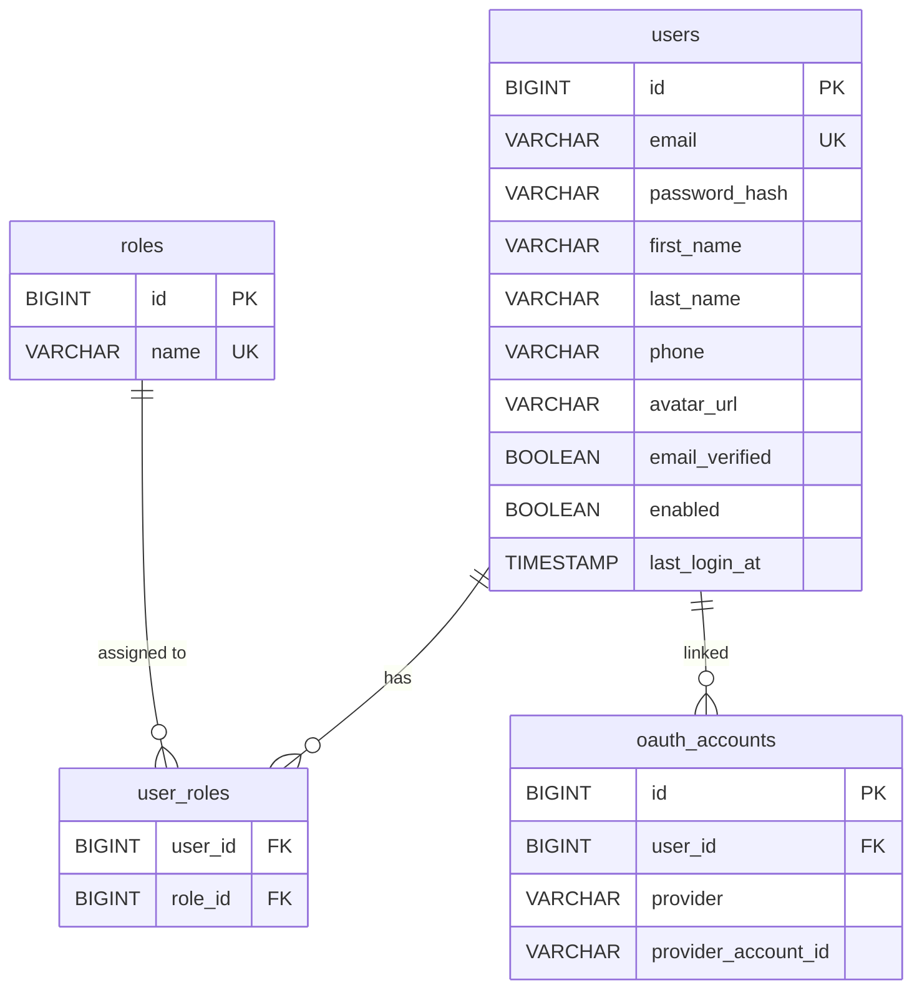
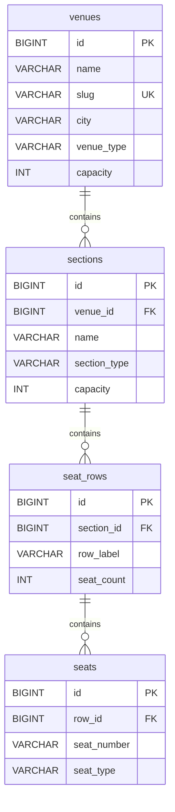
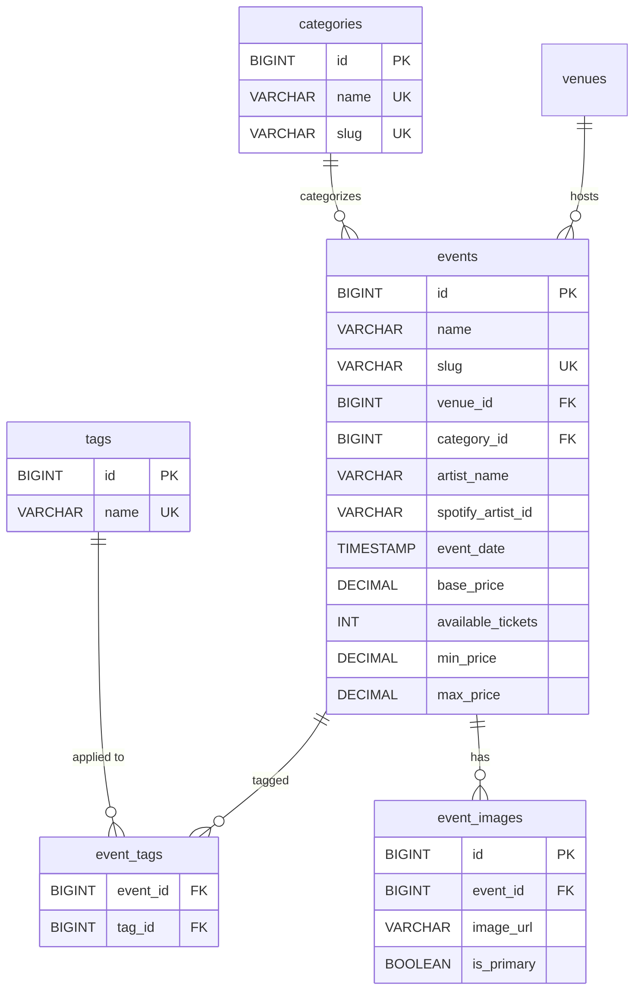
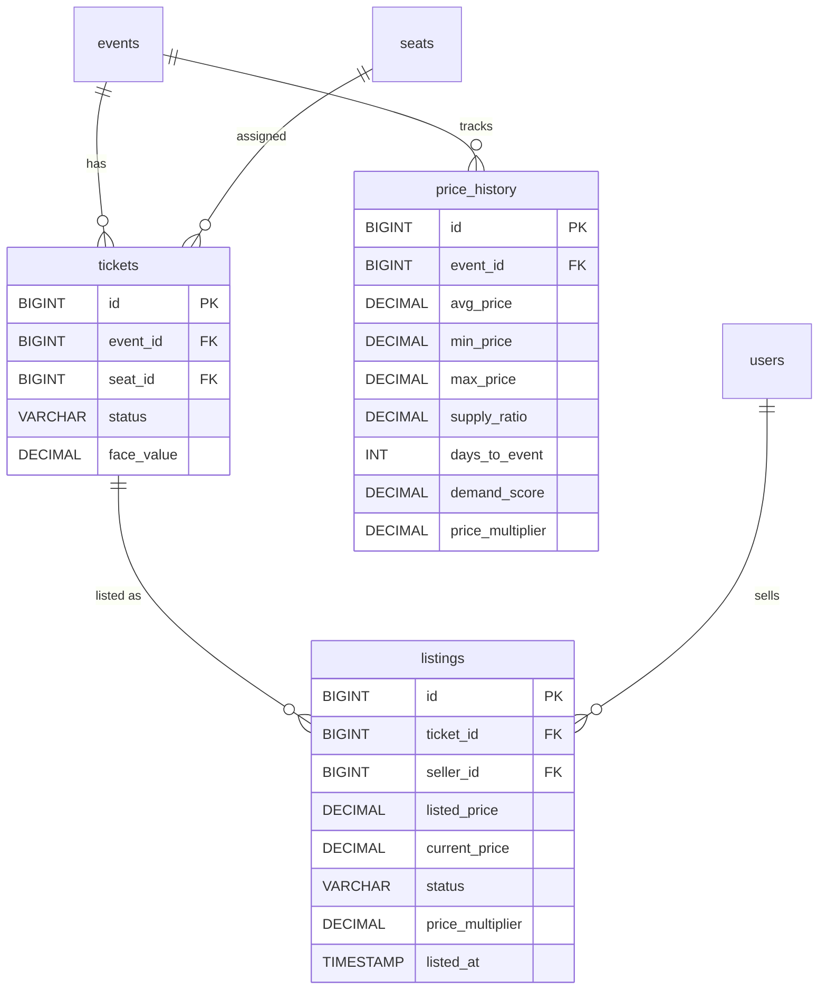
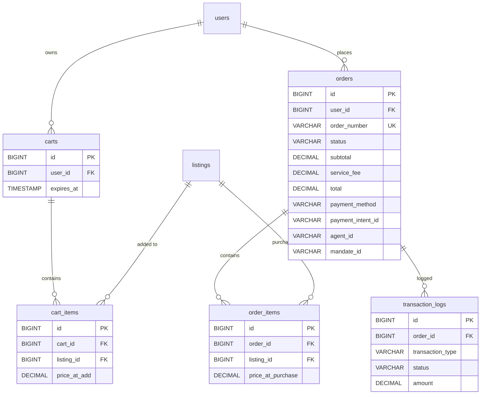
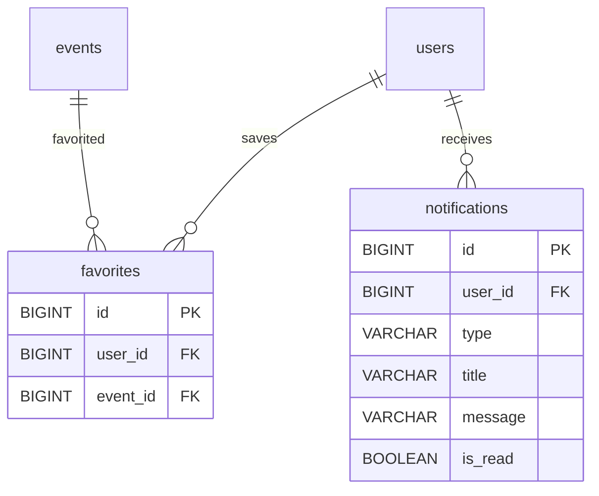
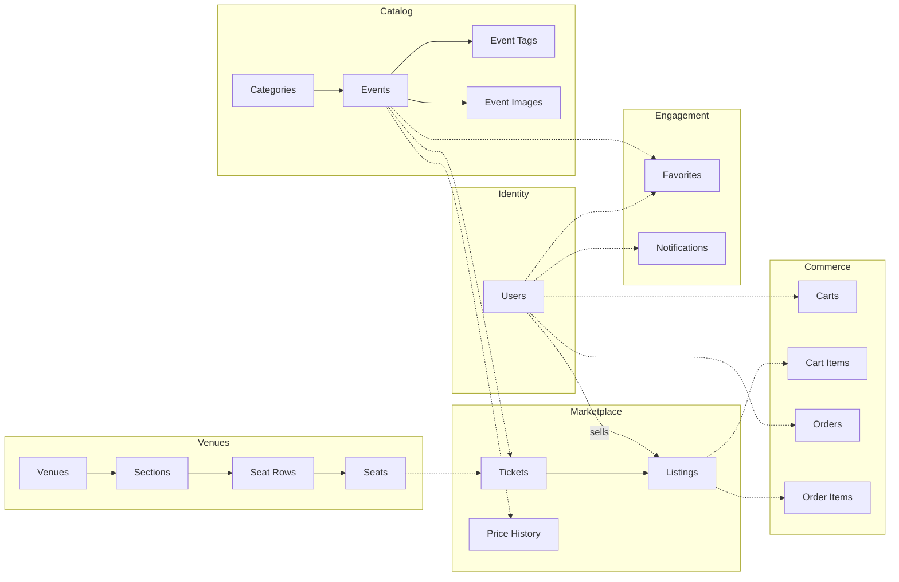

# MockHub -- Architecture

This document describes MockHub's architecture for students and contributors who want to understand the system in depth. For a quick overview, see [README.md](README.md). For implementation rules, see [CLAUDE.md](CLAUDE.md).

## 1. Project Structure

```
mockhub/
├── backend/                    # Spring Boot 4 application
│   ├── build.gradle.kts        # Gradle 9.4.0 (Kotlin DSL, version catalog)
│   └── src/main/java/com/mockhub/
│       ├── acp/                # Agentic Commerce Protocol endpoints
│       ├── auth/               # JWT authentication, Spring Security
│       ├── event/              # Events, categories, tags
│       ├── venue/              # Venues, sections, seat rows, seats
│       ├── ticket/             # Tickets, listings, seller flow
│       ├── pricing/            # Dynamic pricing engine + price history
│       ├── cart/               # Shopping cart
│       ├── order/              # Orders and checkout
│       ├── payment/            # Stripe + mock payment (profile-based)
│       ├── favorite/           # User favorites
│       ├── notification/       # In-app notifications
│       ├── ai/                 # Chat, recommendations, price predictions
│       ├── eval/               # Evaluation conditions (Design by Contract for AI)
│       ├── mandate/            # Agent mandates (authorization for agentic commerce)
│       ├── mcp/                # MCP server (tools, OAuth2 security, session recovery)
│       ├── lifecycle/          # Scheduled cleanup (expired listings, past events, old notifications)
│       ├── admin/              # Admin dashboard
│       ├── search/             # Full-text search (tsvector)
│       ├── image/              # Image storage
│       ├── seed/               # Seed data generation
│       ├── config/             # App configuration
│       └── common/             # Shared utilities, exceptions, base entity
├── frontend/                   # React 19 application
│   ├── src/
│   │   ├── api/                # Typed API client functions
│   │   ├── hooks/              # React Query hooks
│   │   ├── stores/             # Zustand state stores
│   │   ├── pages/              # Route pages
│   │   ├── components/         # UI components (ui/ for shadcn, feature folders for custom)
│   │   ├── types/              # TypeScript type definitions
│   │   └── lib/                # Utilities and formatters
│   └── e2e/                    # Playwright E2E tests
├── gradle/libs.versions.toml   # Gradle version catalog (centralized dependency versions)
├── Dockerfile                  # Combined frontend+backend production build
├── docker-compose.yml          # Full stack (Postgres, backend, frontend)
└── docker-compose.dev.yml      # Postgres only (for local development)
```

**Package organization:** Feature-based, not layer-based. Each domain concept is self-contained with controller/service/repository/entity/dto sub-packages. This reduces merge conflicts and makes navigation intuitive for students.

---

## 2. Database Schema

The schema has six clusters. Flyway migrations are the source of truth (see `backend/src/main/resources/db/migration/`).

### 2.1 Entity-Relationship Overview

1. **Identity**: `users`, `roles`, `user_roles`
2. **Venue/Seating**: `venues`, `sections`, `seat_rows`, `seats`
3. **Events/Catalog**: `events`, `categories`, `tags`, `event_tags`, `event_images`
4. **Marketplace**: `tickets`, `listings`, `price_history`
5. **Commerce**: `carts`, `cart_items`, `orders`, `order_items`, `transaction_logs`
6. **Engagement**: `favorites`, `notifications`, `reviews`, `conversations`, `conversation_messages`, `user_preferences`
7. **Agentic**: `mandates` (agent authorization with scope, spending limits, restrictions)

### Identity



### Venue / Seating



### Events / Catalog



### Marketplace



### Commerce



### Engagement



### Cross-Cluster Relationships



---

## 3. API Design

All endpoints are prefixed with `/api/v1`. List endpoints return paginated responses with `content`, `page`, `size`, `totalElements`, `totalPages` fields.

### Authentication

| Method | Path | Description | Auth |
|---|---|---|---|
| POST | `/auth/register` | Register new user | Public |
| POST | `/auth/login` | Login, returns JWT + refresh token | Public |
| POST | `/auth/refresh` | Refresh access token | Public (valid refresh token) |
| GET | `/auth/me` | Get current user profile | Authenticated |
| PUT | `/auth/me` | Update current user profile | Authenticated |
| POST | `/auth/oauth2/exchange` | Exchange OAuth2 code for JWT | Public |
| GET | `/auth/me/providers` | List linked OAuth providers | Authenticated |

### Events

| Method | Path | Description | Auth |
|---|---|---|---|
| GET | `/events` | List events (paginated, filterable) | Public |
| GET | `/events/featured` | List featured events | Public |
| GET | `/events/{slug}` | Get event by slug | Public |
| GET | `/events/{slug}/listings` | Get active listings for event | Public |
| GET | `/events/{slug}/price-history` | Get price history | Public |
| GET | `/events/{slug}/sections` | Get sections with availability | Public |

**Query parameters for `GET /events`:** `q`, `category`, `tags`, `city`, `dateFrom`, `dateTo`, `minPrice`, `maxPrice`, `status`, `sort` (date, price_asc, price_desc, name, popularity), `page`, `size`

### Cart

| Method | Path | Description | Auth |
|---|---|---|---|
| GET | `/cart` | Get current user's cart | Authenticated |
| POST | `/cart/items` | Add listing to cart | Authenticated |
| DELETE | `/cart/items/{itemId}` | Remove item from cart | Authenticated |
| DELETE | `/cart` | Clear entire cart | Authenticated |

### Orders

| Method | Path | Description | Auth |
|---|---|---|---|
| POST | `/orders/checkout` | Create order from cart | Authenticated |
| GET | `/orders` | List user's orders (paginated) | Authenticated |
| GET | `/orders/{orderNumber}` | Get order details | Authenticated (own) |
| GET | `/orders/{orderNumber}/calendar` | Download .ics calendar file | Authenticated (own) |

### Payments

| Method | Path | Description | Auth |
|---|---|---|---|
| POST | `/payments/create-intent` | Create Stripe payment intent | Authenticated |
| POST | `/payments/confirm` | Confirm payment (mock flow) | Authenticated |
| POST | `/payments/webhook` | Stripe webhook handler | Public (Stripe signature) |

### Favorites

| Method | Path | Description | Auth |
|---|---|---|---|
| GET | `/favorites` | List user's favorited events | Authenticated |
| POST | `/favorites/{eventId}` | Add event to favorites | Authenticated |
| DELETE | `/favorites/{eventId}` | Remove from favorites | Authenticated |
| GET | `/favorites/check/{eventId}` | Check if event is favorited | Authenticated |

### Seller Listings

| Method | Path | Description | Auth |
|---|---|---|---|
| POST | `/listings` | Create a listing (eventSlug, section, row, seat, price) | Authenticated |
| GET | `/my/listings` | List seller's own listings (`?status=ACTIVE\|SOLD\|CANCELLED`) | Authenticated |
| PUT | `/listings/{id}/price` | Update listing price (owner only) | Authenticated |
| DELETE | `/listings/{id}` | Deactivate listing (owner only) | Authenticated |
| GET | `/my/earnings` | Seller earnings summary with recent sales | Authenticated |

No separate seller role — any authenticated user can sell. `listings.seller_id` is nullable: NULL = platform listing, non-null = user-created resale listing.

### Notifications

| Method | Path | Description | Auth |
|---|---|---|---|
| GET | `/notifications` | List user's notifications (paginated) | Authenticated |
| PUT | `/notifications/{id}/read` | Mark as read | Authenticated |
| PUT | `/notifications/read-all` | Mark all as read | Authenticated |
| GET | `/notifications/unread-count` | Get unread count | Authenticated |

### Search

| Method | Path | Description | Auth |
|---|---|---|---|
| GET | `/search` | Full-text search across events | Public |

### AI

| Method | Path | Description | Auth |
|---|---|---|---|
| POST | `/chat` | Chat assistant (function-calling enabled) | Authenticated |
| GET | `/recommendations` | Personalized AI-ranked event recommendations | Public (personalized when authenticated) |
| GET | `/events/{slug}/predicted-price` | Price trend prediction | Public |

### Admin

| Method | Path | Description | Auth |
|---|---|---|---|
| GET | `/admin/dashboard` | Dashboard statistics | Admin |
| GET | `/admin/events` | List all events (admin view) | Admin |
| POST | `/admin/events` | Create event | Admin |
| PUT | `/admin/events/{id}` | Update event | Admin |
| GET | `/admin/users` | List users | Admin |
| PUT | `/admin/users/{id}/roles` | Update user roles | Admin |
| PUT | `/admin/users/{id}/toggle` | Enable/disable user | Admin |

---

## 4. Backend Architecture

### Layer Architecture

```
HTTP Request → [Controller] → [Service] → [Repository] → Database
                validates       business     Spring Data
                input, maps     logic,       JPA
                DTOs            transactions
```

**Rules:**
- Controllers never access repositories directly
- Services call other services (never other controllers)
- Entities never leak outside the service layer — DTOs for all external communication
- Write operations use `@Transactional`, reads use `@Transactional(readOnly = true)`

### Dynamic Pricing Engine

The pricing engine is one of the most pedagogically important components. It computes a `price_multiplier` for each event's listings based on three factors:

1. **Supply Factor** (available_tickets / total_tickets):
   - 90%+ available → 0.85 (drop to stimulate sales)
   - 50-90% available → 1.0 (neutral)
   - 20-50% available → 1.3 (scarcity premium)
   - <20% available → 1.8 (high scarcity)

2. **Time Factor** (days until event):
   - 60+ days → 0.9 (early bird discount)
   - 14-60 days → 1.0 (neutral)
   - 3-14 days → 1.2 (urgency premium)
   - <3 days → 1.5 (last-minute surge)
   - Day of event → 0.7 (fire sale)

3. **Demand Factor** (cart-adds + favorites in last 24h):
   - Normalized to 0.9-1.5 range

**Final multiplier** = clamp(supply × time × demand, 0.5, 3.0)

A `@Scheduled` task runs `updateAllPricing()` every 15 minutes. Each update writes to `price_history`, building the dataset students use for ML exercises.

### Payment Abstraction

Two implementations controlled by Spring profiles:

- **`MockPaymentService`** (`mock-payment` profile) — simulates payments with configurable delays. Always succeeds unless special test card numbers are used.
- **`StripePaymentService`** (`stripe` profile) — real Stripe test-mode integration. `@Primary` resolves conflicts when both profiles are active.

### Error Handling

`GlobalExceptionHandler` (`@RestControllerAdvice`) maps domain exceptions to RFC 9457 Problem Details:

| Exception | HTTP Status |
|---|---|
| `ResourceNotFoundException` | 404 |
| `ConflictException` | 409 |
| `PaymentException` | 402 |
| `UnauthorizedException` | 401 |
| Validation errors | 400 |

`DomainException` is `abstract sealed`, permitting only these four subtypes. The handler uses an exhaustive pattern-matching switch with no default case.

### DTO Patterns

- `*Request` records — incoming data with Jakarta validation
- `*Dto` records — outgoing data (API responses)
- `*SummaryDto` records — subset of fields for list views
- Mapping is explicit in service methods (no MapStruct — transparent for students)

### Spring AI Integration

- **ChatClient** configured with function-calling tools (`EventTools`, `PricingTools`) via `.defaultToolCallbacks()`
- **Same `@Tool`-annotated classes** serve both the MCP server (external agents) and the chat endpoint (users)
- **Conditional activation** via `@ConditionalOnProperty(name = "spring.ai.anthropic.api-key")` — not `@ConditionalOnBean` (evaluates before auto-config)
- **`AiController`** injects `Optional<ChatService>` etc. and returns 503 when no AI provider is active
- **Personalized recommendations:** `RecommendationService` accepts a nullable `userId` and optional `city` — when provided, enriches the AI prompt with user favorites, purchase history, and Spotify listening data (top artists, genres, recently played) for personalized ranking. Spotify-matched events are included in the candidate pool even if not featured. Falls back to generic recommendations for anonymous users.
- **Circular dependency** (MCP tools → PricingTools → PricePredictionService → ChatClient) broken with `@Lazy`

### SMS Delivery

Profile-based SMS notification on order confirmation:

- **Interface:** `SmsDeliveryService` with `MockSmsDeliveryService` (mock-sms) and `TwilioSmsDeliveryService` (sms-twilio, `@Primary`)
- **Returns message SID** (or null on failure) for delivery tracking
- **Trigger:** `OrderService.confirmOrder()` sends SMS with event name and public ticket view link when user has phone number
- **Twilio SDK:** 10.9.2, auth via env vars (`TWILIO_ACCOUNT_SID`, `TWILIO_AUTH_TOKEN`, `TWILIO_PHONE_NUMBER`)
- **Failure handling:** caught and logged, never breaks checkout
- **Integration test:** `TwilioSmsDeliveryServiceIntegrationTest` — `@Tag("twilio")`, excluded from normal runs, invoked via `./gradlew test -PincludeTags=twilio`

### Email Delivery

Profile-based email notification on order confirmation:

- **Interface:** `EmailDeliveryService` with three implementations:
  - `MockEmailDeliveryService` (mock-email profile) — console logging
  - `SmtpEmailDeliveryService` (email-smtp profile) — Spring `JavaMailSender`, works with any SMTP provider
  - `ResendEmailDeliveryService` (email-resend profile, `@Primary`) — Resend REST API via Spring `RestClient`. Preferred in production because Railway blocks SMTP port 465.
- **Trigger:** `OrderService.confirmOrder()` sends HTML email with order summary and "View Your Tickets" button linking to the public ticket view page.
- **Email content:** Event name, order number, ticket count, total, and a styled CTA button to the public ticket view.
- **From address:** `mockhub.email.from-address` (env: `EMAIL_FROM_ADDRESS`). Resend free tier uses `onboarding@resend.dev`; custom domains require verification.
- **Failure handling:** catches both `MessagingException` and `MailException`, logs and returns null.

### Ticket PDF Generation

Downloadable ticket PDFs with cryptographically signed QR codes:

- **Pipeline:** `TicketSigningService` (JJWT) → `QrCodeService` (ZXing) → `TicketPdfService` (PDFBox)
- **QR content:** JWT signed with HMAC-SHA256 containing order number, ticket ID, event slug, section/row/seat
- **Download:** `GET /api/v1/orders/{orderNumber}/tickets/{ticketId}/download` (authenticated, validates ownership + CONFIRMED status)
- **Verification:** `GET /api/v1/tickets/verify?token={jwt}` (public, marks first scan, warns on re-scan)
- **Scan tracking:** `scannedAt` nullable timestamp on `OrderItem` entity (V21 migration)
- **Dependencies:** PDFBox 3.0.4, ZXing core+javase 3.5.3

### Public Ticket View

Token-authenticated public page for viewing tickets from SMS/email links:

- **Route:** `/tickets/view?token={orderViewToken}` — no login required
- **Order-view JWT:** Signed with same HMAC-SHA256 key as ticket tokens, distinguished by `typ: "order-view"` claim. No expiration. Generated by `TicketSigningService.generateOrderViewToken()`.
- **API endpoints (public):**
  - `GET /api/v1/tickets/view?token=...` — returns `PublicOrderViewDto` (event name, date, venue, ticket list with QR URLs)
  - `GET /api/v1/tickets/{orderNumber}/{ticketId}/qr?token=...` — returns QR code PNG image (300x300)
- **Read-only:** Does NOT mark tickets as scanned — that only happens via the `/api/v1/tickets/verify` endpoint (venue scanning).
- **QR codes match PDF tickets** — same verification URL, scanning triggers existing verify flow.
- **Frontend:** `PublicTicketViewPage` — mobile-optimized, shows event header + large QR code cards. No PII exposed.
- **Security:** Order-view tokens cannot scan tickets (no `tic` claim). QR image endpoint validates token and order number match.

### Evaluation Conditions

Formalized sanity checks (Design by Contract for AI agents) in `com.mockhub.eval`:

- **Deterministic conditions** (always run): `EventInFutureCondition`, `ListingActiveCondition`, `PricePlausibilityCondition`, `RecommendationAvailabilityCondition`, `CartTotalIntegrityCondition`
- **AI-as-judge conditions** (opt-in): `GroundingEvalCondition` uses a separate `evalJudgeChatClient` bean to verify chat responses aren't fabricated
- **Integration:** `EvalRunner` wired into `ChatService` (post-response logging), `PricePredictionService` (fallback on critical failure), `RecommendationService` (warning logging), `CartTools` (blocks agent add-to-cart on critical failure)
- **Configuration:** `mockhub.eval.ai-judge.enabled` (default false), `mockhub.eval.price-plausibility.min-ratio` / `max-ratio`
- **Design:** `EvalCondition` interface (not sealed — Mockito compatibility), `EvalResult` records, explicit service calls (no AOP)
- See `docs/evaluation-conditions.md` for full documentation including Design by Contract mapping and Nate Jones's contextual stewardship framework

### Caching Strategy

Cached (in-memory `ConcurrentMapCacheManager`):
- Categories and tags (1 hour)
- Venue details (30 minutes)
- Featured events (5 minutes)
- Event detail pages (2 minutes, evicted on update)

Never cached: carts, orders, notifications, pricing data.

---

## 5. Frontend Architecture

### Routes

```
/                                → HomePage (featured events, categories, search, AI recommendations)
/login                           → LoginPage
/register                        → RegisterPage
/events                          → EventListPage (search, filter, sort, paginate)
/events/:slug                    → EventDetailPage (listings, price history, price prediction)
/cart                            → CartPage
/checkout                        → CheckoutPage (auth required)
/orders/:orderNumber/confirmation → OrderConfirmationPage
/orders                          → OrderHistoryPage (auth required)
/favorites                       → FavoritesPage (auth required)
/sell                            → SellPage (3-step listing form)
/my/listings                     → MyListingsPage (tab filtering, inline price editing)
/my/earnings                     → EarningsPage (summary stats, recent sales)
/my/profile                      → ProfilePage (auth required)
/auth/callback                   → AuthCallbackPage (OAuth2 code exchange)
/tickets/view                    → PublicTicketViewPage (token-authenticated, no login)
/admin                           → AdminDashboardPage (admin required)
/admin/events                    → AdminEventsPage
/admin/events/new                → AdminEventFormPage
/admin/events/:id/edit           → AdminEventFormPage
/admin/users                     → AdminUsersPage
```

### State Management

**TanStack React Query** for all server state (events, cart, orders, favorites, notifications, search, admin data).

**Zustand** for client-only state:
- `authStore` — user, JWT token (in memory), isAuthenticated
- `cartStore` — item count (synced from React Query), drawer open/close

### API Client Layer

```
api/*.ts        → typed functions (getEvents, addToCart, etc.)
hooks/use*.ts   → React Query wrappers (useEvents, useCart, etc.)
components      → use hooks, never call API functions directly
```

Axios interceptor attaches JWT from authStore, handles 401 → refresh → retry.

### Responsive Design

Mobile-first with Tailwind breakpoints:
- EventGrid: 1 col → 2 col (sm) → 3 col (lg) → 4 col (xl)
- Filters: slide-out Sheet on mobile, sidebar on lg+
- Cart: full page on mobile, drawer on md+
- Header: hamburger menu on mobile, full nav on md+

---

## 6. Testing Strategy

### Backend

| Type | Tool | Location |
|---|---|---|
| Unit tests | JUnit 5 + Mockito | `{feature}/service/*Test.java` |
| Controller tests | MockMvc + @WebMvcTest | `{feature}/controller/*Test.java` |
| Integration tests | Testcontainers + @SpringBootTest | `integration/*Test.java` |

Naming convention: `methodName_givenCondition_expectedResult`

### Frontend

| Type | Tool | Location |
|---|---|---|
| Component tests | Vitest + React Testing Library | Colocated as `*.test.tsx` |
| API mocking | MSW (Mock Service Worker) | `src/test/mocks/` |
| E2E tests | Playwright (3 browsers, sharded CI) | `e2e/*.spec.ts` |
| Accessibility | axe-core + Playwright | Included in E2E specs |

**Playwright browser targets:** Chrome, Safari, Mobile iOS (3 browsers covering all rendering engines, sharded across 2 CI jobs)

---

## 7. Key Architectural Decisions

1. **Feature-based packages** over layer-based — self-contained domains, less merge conflicts, intuitive navigation for students.

2. **Flyway** over JPA auto-DDL — students learn real migration practices. `validate` mode ensures entities match migrations.

3. **JWT in memory** (not localStorage) — teaches security best practices. Refresh tokens in HttpOnly cookies prevent XSS token theft.

4. **Spring profiles for payment** — demonstrates Strategy pattern in a practical context. DI and profiles enable swappable implementations.

5. **Denormalized counts** on events (`available_tickets`, `min_price`, `max_price`) — avoids expensive joins on list pages. Updated transactionally.

6. **PostgreSQL tsvector** for search — built-in full-text search, no Elasticsearch complexity. Adequate for v1 with stable endpoint contracts for future replacement.

7. **Price history as first-class table** — the dataset students use for ML exercises. Every pricing update creates a historical record with contextual features.

8. **Future tables created empty** — reviews, conversations, preferences exist from day one so AI exercise code can write to them without migrations.

9. **No Lombok** — Java records handle DTOs. Entities use explicit getters/setters, which is more transparent for students learning JPA.

10. **Spring AI in the foundation** — same DI and auto-configuration patterns students already know, rather than bolting AI on later.

11. **Datafaker for seed data** — `net.datafaker:datafaker` generates realistic names, cities, dates for hundreds of records.

---

## 8. Deployment

### Railway (Production)

- **URL:** https://mockhub.kousenit.com
- **Architecture:** Single Docker container serves both Spring Boot API and React SPA (no CORS needed)
- **SPA routing:** `SpaForwardingConfig` serves `index.html` for client-side routes, excludes `/api/`, `/actuator/`, `/mcp/`, `/acp/`, `/oauth2/`, `/.well-known/`, `/swagger-ui/`, `/v3/` paths
- **Ephemeral filesystem:** Seed images restored from classpath on every startup
- **Profiles:** `prod,ai-anthropic,mock-payment,sms-twilio,email-resend,spotify,ticketmaster,mcp-oauth2`
- **Database:** Railway PostgreSQL with `SPRING_DATASOURCE_URL` / `_USERNAME` / `_PASSWORD` (Railway's `DATABASE_URL` format is incompatible with JDBC)
- **Auto-deploy:** Pushes to `main` trigger automatic deployments

### Environment Variables

| Variable | Required | Description |
|---|---|---|
| `JWT_SECRET` | Yes | JWT signing key (min 256 bits, valid Base64) |
| `TICKET_SIGNING_SECRET` | Yes | HMAC-SHA256 key for ticket/order-view JWTs (valid Base64) |
| `ANTHROPIC_API_KEY` | For AI | Anthropic API key |
| `STRIPE_SECRET_KEY` | For Stripe | Stripe test secret key |
| `TWILIO_ACCOUNT_SID` | For SMS | Twilio account SID |
| `TWILIO_AUTH_TOKEN` | For SMS | Twilio auth token |
| `TWILIO_PHONE_NUMBER` | For SMS | Twilio "from" phone number |
| `RESEND_API_KEY` | For email | Resend API key (REST API or SMTP password) |
| `EMAIL_FROM_ADDRESS` | For email | Sender address (default: `noreply@mockhub.dev`) |
| `GOOGLE_CLIENT_ID` | For OAuth | Google OAuth2 client ID |
| `GOOGLE_CLIENT_SECRET` | For OAuth | Google OAuth2 client secret |
| `GITHUB_CLIENT_ID` | For OAuth | GitHub OAuth2 client ID |
| `GITHUB_CLIENT_SECRET` | For OAuth | GitHub OAuth2 client secret |
| `OAUTH2_FRONTEND_REDIRECT_URL` | For OAuth | Frontend base URL for OAuth callback |
| `SPOTIFY_CLIENT_ID` | For Spotify | Spotify API client ID |
| `SPOTIFY_CLIENT_SECRET` | For Spotify | Spotify API client secret |
| `SPOTIFY_TOKEN_ENCRYPTION_KEY` | For Spotify | AES-256 key (32-byte Base64) for encrypting stored OAuth tokens |
| `MCP_API_KEY` | For ACP | API key for ACP endpoints (MCP uses OAuth2 when `mcp-oauth2` profile active) |
| `MCP_OAUTH2_ISSUER_URI` | For MCP OAuth2 | OAuth2 issuer URI (must match public URL, e.g., `https://mockhub.kousenit.com`) |
| `SPRING_PROFILES_ACTIVE` | Yes | Profile combination (e.g., `dev,ai-anthropic`) |

### CI (GitHub Actions)

Runs on push to `main` and PRs:
1. Backend tests (including Testcontainers)
2. Frontend lint + typecheck + Vitest tests
3. SonarCloud analysis
4. Docker build smoke test
