# MockHub -- Complete Architecture and Implementation Plan

## 1. Project Structure

### 1.1 Monorepo Layout

```
mockhub/
├── backend/                          # Spring Boot application
│   ├── build.gradle                  # Gradle build (Kotlin DSL)
│   ├── settings.gradle.kts
│   ├── gradle/
│   │   └── wrapper/
│   ├── src/
│   │   ├── main/
│   │   │   ├── java/com/mockhub/
│   │   │   │   ├── MockHubApplication.java
│   │   │   │   ├── config/
│   │   │   │   │   ├── SecurityConfig.java
│   │   │   │   │   ├── CorsConfig.java
│   │   │   │   │   ├── CacheConfig.java
│   │   │   │   │   ├── JacksonConfig.java
│   │   │   │   │   ├── OpenApiConfig.java
│   │   │   │   │   ├── StripeConfig.java
│   │   │   │   │   └── StorageConfig.java
│   │   │   │   ├── auth/
│   │   │   │   │   ├── controller/AuthController.java
│   │   │   │   │   ├── dto/
│   │   │   │   │   │   ├── LoginRequest.java
│   │   │   │   │   │   ├── RegisterRequest.java
│   │   │   │   │   │   ├── AuthResponse.java
│   │   │   │   │   │   └── UserDto.java
│   │   │   │   │   ├── service/AuthService.java
│   │   │   │   │   ├── security/
│   │   │   │   │   │   ├── JwtTokenProvider.java
│   │   │   │   │   │   ├── JwtAuthenticationFilter.java
│   │   │   │   │   │   ├── UserDetailsServiceImpl.java
│   │   │   │   │   │   └── SecurityUser.java
│   │   │   │   │   └── entity/
│   │   │   │   │       ├── User.java
│   │   │   │   │       └── Role.java
│   │   │   │   ├── event/
│   │   │   │   │   ├── controller/EventController.java
│   │   │   │   │   ├── dto/
│   │   │   │   │   │   ├── EventDto.java
│   │   │   │   │   │   ├── EventSummaryDto.java
│   │   │   │   │   │   ├── EventSearchRequest.java
│   │   │   │   │   │   └── EventCreateRequest.java
│   │   │   │   │   ├── service/EventService.java
│   │   │   │   │   ├── repository/EventRepository.java
│   │   │   │   │   └── entity/
│   │   │   │   │       ├── Event.java
│   │   │   │   │       ├── Category.java
│   │   │   │   │       ├── Tag.java
│   │   │   │   │       └── EventTag.java
│   │   │   │   ├── venue/
│   │   │   │   │   ├── controller/VenueController.java
│   │   │   │   │   ├── dto/VenueDto.java
│   │   │   │   │   ├── service/VenueService.java
│   │   │   │   │   ├── repository/VenueRepository.java
│   │   │   │   │   └── entity/
│   │   │   │   │       ├── Venue.java
│   │   │   │   │       ├── Section.java
│   │   │   │   │       ├── SeatRow.java
│   │   │   │   │       └── Seat.java
│   │   │   │   ├── ticket/
│   │   │   │   │   ├── controller/TicketController.java
│   │   │   │   │   ├── dto/
│   │   │   │   │   │   ├── TicketDto.java
│   │   │   │   │   │   ├── ListingDto.java
│   │   │   │   │   │   └── ListingCreateRequest.java
│   │   │   │   │   ├── service/
│   │   │   │   │   │   ├── TicketService.java
│   │   │   │   │   │   └── ListingService.java
│   │   │   │   │   ├── repository/
│   │   │   │   │   │   ├── TicketRepository.java
│   │   │   │   │   │   └── ListingRepository.java
│   │   │   │   │   └── entity/
│   │   │   │   │       ├── Ticket.java
│   │   │   │   │       └── Listing.java
│   │   │   │   ├── pricing/
│   │   │   │   │   ├── controller/PriceController.java
│   │   │   │   │   ├── dto/PriceHistoryDto.java
│   │   │   │   │   ├── service/
│   │   │   │   │   │   ├── PricingEngine.java
│   │   │   │   │   │   └── PriceHistoryService.java
│   │   │   │   │   ├── repository/PriceHistoryRepository.java
│   │   │   │   │   └── entity/PriceHistory.java
│   │   │   │   ├── cart/
│   │   │   │   │   ├── controller/CartController.java
│   │   │   │   │   ├── dto/
│   │   │   │   │   │   ├── CartDto.java
│   │   │   │   │   │   └── AddToCartRequest.java
│   │   │   │   │   ├── service/CartService.java
│   │   │   │   │   ├── repository/
│   │   │   │   │   │   ├── CartRepository.java
│   │   │   │   │   │   └── CartItemRepository.java
│   │   │   │   │   └── entity/
│   │   │   │   │       ├── Cart.java
│   │   │   │   │       └── CartItem.java
│   │   │   │   ├── order/
│   │   │   │   │   ├── controller/OrderController.java
│   │   │   │   │   ├── dto/
│   │   │   │   │   │   ├── OrderDto.java
│   │   │   │   │   │   ├── OrderSummaryDto.java
│   │   │   │   │   │   └── CheckoutRequest.java
│   │   │   │   │   ├── service/OrderService.java
│   │   │   │   │   ├── repository/
│   │   │   │   │   │   ├── OrderRepository.java
│   │   │   │   │   │   └── OrderItemRepository.java
│   │   │   │   │   └── entity/
│   │   │   │   │       ├── Order.java
│   │   │   │   │       └── OrderItem.java
│   │   │   │   ├── payment/
│   │   │   │   │   ├── controller/PaymentController.java
│   │   │   │   │   ├── dto/
│   │   │   │   │   │   ├── PaymentIntentDto.java
│   │   │   │   │   │   └── PaymentConfirmation.java
│   │   │   │   │   ├── service/
│   │   │   │   │   │   ├── PaymentService.java          # interface
│   │   │   │   │   │   ├── StripePaymentService.java    # @Profile("stripe")
│   │   │   │   │   │   └── MockPaymentService.java      # @Profile("mock-payment")
│   │   │   │   │   └── entity/TransactionLog.java
│   │   │   │   ├── favorite/
│   │   │   │   │   ├── controller/FavoriteController.java
│   │   │   │   │   ├── dto/FavoriteDto.java
│   │   │   │   │   ├── service/FavoriteService.java
│   │   │   │   │   ├── repository/FavoriteRepository.java
│   │   │   │   │   └── entity/Favorite.java
│   │   │   │   ├── notification/
│   │   │   │   │   ├── controller/NotificationController.java
│   │   │   │   │   ├── dto/NotificationDto.java
│   │   │   │   │   ├── service/NotificationService.java
│   │   │   │   │   ├── repository/NotificationRepository.java
│   │   │   │   │   └── entity/Notification.java
│   │   │   │   ├── image/
│   │   │   │   │   ├── controller/ImageController.java
│   │   │   │   │   ├── service/
│   │   │   │   │   │   ├── ImageStorageService.java     # interface
│   │   │   │   │   │   ├── LocalImageStorageService.java
│   │   │   │   │   │   └── ImageResizer.java
│   │   │   │   │   └── entity/EventImage.java
│   │   │   │   ├── admin/
│   │   │   │   │   ├── controller/AdminController.java
│   │   │   │   │   ├── dto/
│   │   │   │   │   │   ├── DashboardStatsDto.java
│   │   │   │   │   │   └── AdminEventDto.java
│   │   │   │   │   └── service/AdminService.java
│   │   │   │   ├── search/
│   │   │   │   │   ├── controller/SearchController.java
│   │   │   │   │   ├── dto/SearchResultDto.java
│   │   │   │   │   └── service/SearchService.java
│   │   │   │   ├── seed/
│   │   │   │   │   ├── DataSeeder.java
│   │   │   │   │   ├── VenueSeeder.java
│   │   │   │   │   ├── EventSeeder.java
│   │   │   │   │   ├── TicketSeeder.java
│   │   │   │   │   └── UserSeeder.java
│   │   │   │   └── common/
│   │   │   │       ├── dto/
│   │   │   │       │   ├── PagedResponse.java
│   │   │   │       │   └── ErrorResponse.java
│   │   │   │       ├── exception/
│   │   │   │       │   ├── GlobalExceptionHandler.java
│   │   │   │       │   ├── ResourceNotFoundException.java
│   │   │   │       │   ├── ConflictException.java
│   │   │   │       │   ├── PaymentException.java
│   │   │   │       │   └── UnauthorizedException.java
│   │   │   │       ├── entity/BaseEntity.java
│   │   │   │       └── util/
│   │   │   │           └── SlugUtil.java
│   │   │   └── resources/
│   │   │       ├── application.yml
│   │   │       ├── application-dev.yml
│   │   │       ├── application-docker.yml
│   │   │       ├── application-test.yml
│   │   │       ├── db/migration/               # Flyway migrations
│   │   │       │   ├── V1__create_users.sql
│   │   │       │   ├── V2__create_venues_seats.sql
│   │   │       │   ├── V3__create_events.sql
│   │   │       │   ├── V4__create_tickets_listings.sql
│   │   │       │   ├── V5__create_pricing.sql
│   │   │       │   ├── V6__create_cart_orders.sql
│   │   │       │   ├── V7__create_favorites_notifications.sql
│   │   │       │   ├── V8__create_images.sql
│   │   │       │   ├── V9__create_reviews.sql
│   │   │       │   ├── V10__create_search_indexes.sql
│   │   │       │   ├── V11__create_transaction_logs.sql
│   │   │       │   ├── V12__create_conversations.sql
│   │   │       │   └── V13__create_user_preferences.sql
│   │   │       └── seed/
│   │   │           ├── venues.json
│   │   │           ├── events.json
│   │   │           └── artists.json
│   │   └── test/
│   │       ├── java/com/mockhub/
│   │       │   ├── auth/
│   │       │   │   ├── controller/AuthControllerTest.java
│   │       │   │   └── service/AuthServiceTest.java
│   │       │   ├── event/
│   │       │   │   ├── controller/EventControllerTest.java
│   │       │   │   └── service/EventServiceTest.java
│   │       │   ├── pricing/
│   │       │   │   └── service/PricingEngineTest.java
│   │       │   ├── cart/
│   │       │   │   └── service/CartServiceTest.java
│   │       │   ├── order/
│   │       │   │   └── service/OrderServiceTest.java
│   │       │   ├── payment/
│   │       │   │   └── service/MockPaymentServiceTest.java
│   │       │   └── integration/
│   │       │       ├── AbstractIntegrationTest.java
│   │       │       ├── AuthIntegrationTest.java
│   │       │       ├── EventIntegrationTest.java
│   │       │       ├── CartCheckoutIntegrationTest.java
│   │       │       └── AdminIntegrationTest.java
│   │       └── resources/
│   │           └── application-test.yml
│   ├── Dockerfile
│   └── .env.example
├── frontend/
│   ├── package.json
│   ├── tsconfig.json
│   ├── tsconfig.node.json
│   ├── vite.config.ts
│   ├── tailwind.config.ts
│   ├── postcss.config.js
│   ├── components.json                    # shadcn/ui config
│   ├── index.html
│   ├── public/
│   │   └── favicon.svg
│   ├── src/
│   │   ├── main.tsx
│   │   ├── App.tsx
│   │   ├── router.tsx
│   │   ├── api/
│   │   │   ├── client.ts                  # Axios instance + interceptors
│   │   │   ├── auth.ts
│   │   │   ├── events.ts
│   │   │   ├── tickets.ts
│   │   │   ├── cart.ts
│   │   │   ├── orders.ts
│   │   │   ├── favorites.ts
│   │   │   ├── notifications.ts
│   │   │   ├── admin.ts
│   │   │   └── search.ts
│   │   ├── hooks/
│   │   │   ├── useAuth.ts
│   │   │   ├── useEvents.ts
│   │   │   ├── useTickets.ts
│   │   │   ├── useCart.ts
│   │   │   ├── useOrders.ts
│   │   │   ├── useFavorites.ts
│   │   │   ├── useNotifications.ts
│   │   │   ├── useSearch.ts
│   │   │   └── usePagination.ts
│   │   ├── stores/
│   │   │   ├── authStore.ts
│   │   │   ├── cartStore.ts
│   │   │   └── uiStore.ts
│   │   ├── pages/
│   │   │   ├── HomePage.tsx
│   │   │   ├── LoginPage.tsx
│   │   │   ├── RegisterPage.tsx
│   │   │   ├── EventListPage.tsx
│   │   │   ├── EventDetailPage.tsx
│   │   │   ├── CartPage.tsx
│   │   │   ├── CheckoutPage.tsx
│   │   │   ├── OrderConfirmationPage.tsx
│   │   │   ├── OrderHistoryPage.tsx
│   │   │   ├── FavoritesPage.tsx
│   │   │   ├── NotFoundPage.tsx
│   │   │   └── admin/
│   │   │       ├── AdminDashboardPage.tsx
│   │   │       ├── AdminEventsPage.tsx
│   │   │       ├── AdminEventFormPage.tsx
│   │   │       ├── AdminUsersPage.tsx
│   │   │       └── AdminLayout.tsx
│   │   ├── components/
│   │   │   ├── ui/                        # shadcn/ui primitives
│   │   │   │   ├── button.tsx
│   │   │   │   ├── card.tsx
│   │   │   │   ├── input.tsx
│   │   │   │   ├── badge.tsx
│   │   │   │   ├── dialog.tsx
│   │   │   │   ├── dropdown-menu.tsx
│   │   │   │   ├── select.tsx
│   │   │   │   ├── skeleton.tsx
│   │   │   │   ├── table.tsx
│   │   │   │   ├── toast.tsx
│   │   │   │   ├── pagination.tsx
│   │   │   │   └── sheet.tsx
│   │   │   ├── layout/
│   │   │   │   ├── Header.tsx
│   │   │   │   ├── Footer.tsx
│   │   │   │   ├── MainLayout.tsx
│   │   │   │   ├── MobileNav.tsx
│   │   │   │   └── NotificationBell.tsx
│   │   │   ├── events/
│   │   │   │   ├── EventCard.tsx
│   │   │   │   ├── EventGrid.tsx
│   │   │   │   ├── EventFilters.tsx
│   │   │   │   ├── EventSearch.tsx
│   │   │   │   ├── CategoryNav.tsx
│   │   │   │   └── FavoriteButton.tsx
│   │   │   ├── tickets/
│   │   │   │   ├── TicketListView.tsx
│   │   │   │   ├── TicketGridView.tsx
│   │   │   │   ├── SeatSelector.tsx
│   │   │   │   ├── PriceTag.tsx
│   │   │   │   └── TicketQuantityPicker.tsx
│   │   │   ├── cart/
│   │   │   │   ├── CartDrawer.tsx
│   │   │   │   ├── CartItem.tsx
│   │   │   │   └── CartSummary.tsx
│   │   │   ├── checkout/
│   │   │   │   ├── CheckoutForm.tsx
│   │   │   │   ├── StripePaymentForm.tsx
│   │   │   │   ├── MockPaymentForm.tsx
│   │   │   │   └── OrderReview.tsx
│   │   │   ├── orders/
│   │   │   │   ├── OrderCard.tsx
│   │   │   │   └── OrderItemRow.tsx
│   │   │   └── common/
│   │   │       ├── LoadingSpinner.tsx
│   │   │       ├── ErrorBoundary.tsx
│   │   │       ├── EmptyState.tsx
│   │   │       ├── ProtectedRoute.tsx
│   │   │       ├── AdminRoute.tsx
│   │   │       └── PriceDisplay.tsx
│   │   ├── lib/
│   │   │   ├── utils.ts                   # shadcn/ui utility (cn function)
│   │   │   ├── formatters.ts              # date, currency formatting
│   │   │   └── constants.ts
│   │   └── types/
│   │       ├── auth.ts
│   │       ├── event.ts
│   │       ├── ticket.ts
│   │       ├── cart.ts
│   │       ├── order.ts
│   │       └── common.ts
│   ├── e2e/
│   │   ├── playwright.config.ts
│   │   ├── auth.spec.ts
│   │   ├── event-browsing.spec.ts
│   │   ├── cart-checkout.spec.ts
│   │   └── admin.spec.ts
│   ├── Dockerfile
│   └── .env.example
├── docker-compose.yml
├── docker-compose.dev.yml
├── .gitignore
├── README.md
└── CLAUDE.md                              # Project-specific Claude instructions
```

### 1.2 Package Organization Rationale

The backend uses **feature-based packaging** (not layer-based). Each domain concept (`event`, `ticket`, `cart`, etc.) is a self-contained package with its own controller, service, repository, entity, and DTO sub-packages. This makes it straightforward for students to understand which code belongs to which feature, and for agents to work on features in parallel without merge conflicts.

The `common` package contains cross-cutting concerns: the base entity, global exception handler, shared DTOs, and utilities.

The `seed` package is separate and clearly marked as development-only infrastructure.

---

## 2. Database Schema / Data Model

### 2.1 Entity-Relationship Overview

The schema has five major clusters:

1. **Identity**: `users`, `roles`, `user_roles`
2. **Venue/Seating**: `venues`, `sections`, `seat_rows`, `seats`
3. **Events/Catalog**: `events`, `categories`, `tags`, `event_tags`, `event_images`
4. **Marketplace**: `tickets`, `listings`, `price_history`
5. **Commerce**: `carts`, `cart_items`, `orders`, `order_items`, `transaction_logs`
6. **Engagement**: `favorites`, `notifications`, `reviews`, `conversations`, `conversation_messages`, `user_preferences`

#### Cluster 1 -- Identity ER Diagram

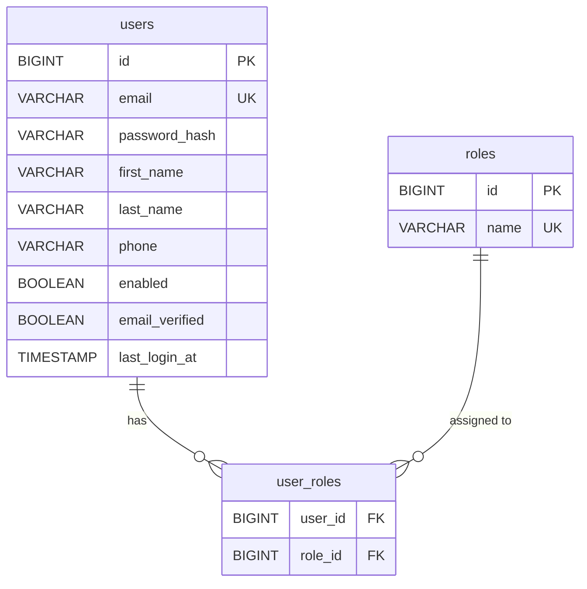

#### Cluster 2 -- Venue / Seating ER Diagram

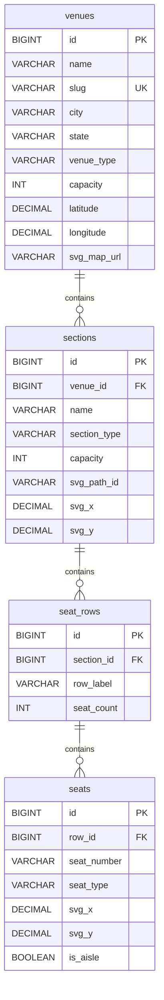

#### Cluster 3 -- Events / Catalog ER Diagram

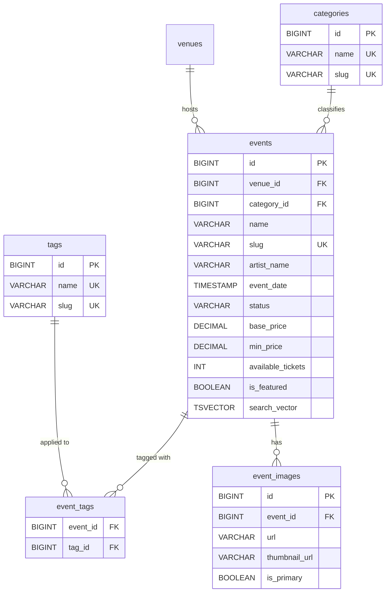

#### Cluster 4 -- Marketplace ER Diagram

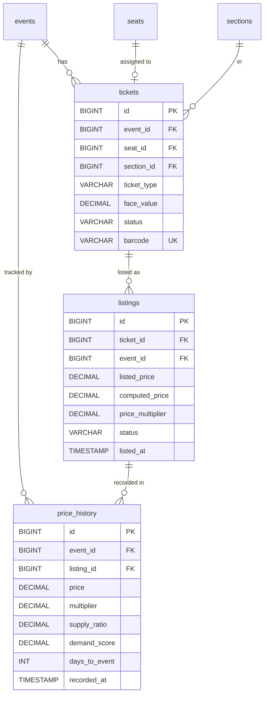

#### Cluster 5 -- Commerce ER Diagram

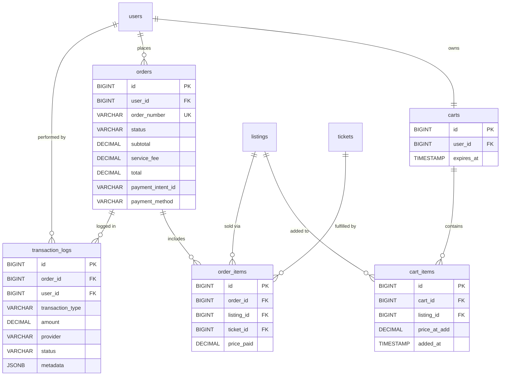

#### Cluster 6 -- Engagement ER Diagram

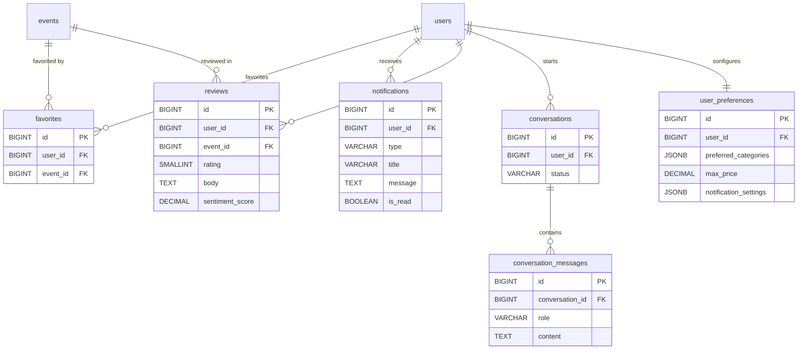

#### Cross-Cluster Relationships Overview

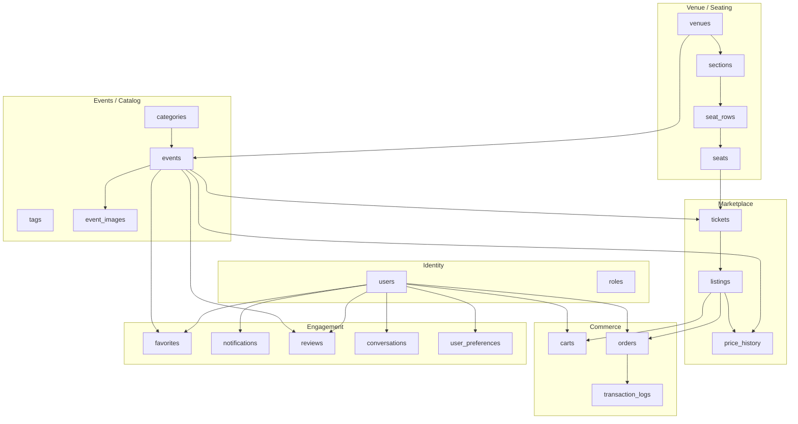

### 2.2 Complete Table Definitions

All tables include `id` (BIGINT, auto-generated), `created_at` (TIMESTAMP WITH TIME ZONE, NOT NULL, DEFAULT NOW()), and `updated_at` (TIMESTAMP WITH TIME ZONE, NOT NULL, DEFAULT NOW()). These are omitted below for brevity but are present on every table via `BaseEntity`.

#### Cluster 1 -- Identity

**`users`**
| Column | Type | Constraints | Notes |
|---|---|---|---|
| id | BIGINT | PK, auto | |
| email | VARCHAR(255) | UNIQUE, NOT NULL | Login identifier |
| password_hash | VARCHAR(255) | NOT NULL | BCrypt encoded |
| first_name | VARCHAR(100) | NOT NULL | |
| last_name | VARCHAR(100) | NOT NULL | |
| phone | VARCHAR(20) | NULLABLE | |
| avatar_url | VARCHAR(500) | NULLABLE | |
| enabled | BOOLEAN | NOT NULL, DEFAULT TRUE | Account active flag |
| email_verified | BOOLEAN | NOT NULL, DEFAULT FALSE | For future verification |
| last_login_at | TIMESTAMP WITH TIME ZONE | NULLABLE | |
| created_at | TIMESTAMP WITH TIME ZONE | NOT NULL | |
| updated_at | TIMESTAMP WITH TIME ZONE | NOT NULL | |

Indexes: `idx_users_email` on (email)

**`roles`**
| Column | Type | Constraints |
|---|---|---|
| id | BIGINT | PK, auto |
| name | VARCHAR(50) | UNIQUE, NOT NULL |

Seeded values: `ROLE_BUYER`, `ROLE_ADMIN`

**`user_roles`** (join table)
| Column | Type | Constraints |
|---|---|---|
| user_id | BIGINT | FK -> users(id), NOT NULL |
| role_id | BIGINT | FK -> roles(id), NOT NULL |

PK: (user_id, role_id)

#### Cluster 2 -- Venue / Seating

**`venues`**
| Column | Type | Constraints | Notes |
|---|---|---|---|
| id | BIGINT | PK | |
| name | VARCHAR(255) | NOT NULL | |
| slug | VARCHAR(255) | UNIQUE, NOT NULL | URL-friendly |
| address_line1 | VARCHAR(255) | NOT NULL | |
| address_line2 | VARCHAR(255) | NULLABLE | |
| city | VARCHAR(100) | NOT NULL | |
| state | VARCHAR(50) | NOT NULL | |
| zip_code | VARCHAR(20) | NOT NULL | |
| country | VARCHAR(50) | NOT NULL, DEFAULT 'US' | |
| latitude | DECIMAL(9,6) | NULLABLE | For future map features |
| longitude | DECIMAL(9,6) | NULLABLE | |
| capacity | INT | NOT NULL | Total capacity |
| venue_type | VARCHAR(50) | NOT NULL | ARENA, STADIUM, THEATER, CLUB, OUTDOOR |
| image_url | VARCHAR(500) | NULLABLE | |
| svg_map_url | VARCHAR(500) | NULLABLE | For future SVG seat maps |

Indexes: `idx_venues_slug` on (slug), `idx_venues_city` on (city)

**`sections`**
| Column | Type | Constraints | Notes |
|---|---|---|---|
| id | BIGINT | PK | |
| venue_id | BIGINT | FK -> venues(id), NOT NULL | |
| name | VARCHAR(100) | NOT NULL | e.g., "Floor", "Section 101", "Balcony A" |
| section_type | VARCHAR(50) | NOT NULL | FLOOR, LOWER, UPPER, BALCONY, BOX, GA |
| capacity | INT | NOT NULL | |
| sort_order | INT | NOT NULL, DEFAULT 0 | Display ordering |
| svg_path_id | VARCHAR(100) | NULLABLE | SVG element ID for future map |
| svg_x | DECIMAL(8,2) | NULLABLE | SVG map x-coordinate |
| svg_y | DECIMAL(8,2) | NULLABLE | SVG map y-coordinate |
| svg_width | DECIMAL(8,2) | NULLABLE | SVG bounding box |
| svg_height | DECIMAL(8,2) | NULLABLE | SVG bounding box |
| color_hex | VARCHAR(7) | NULLABLE | For map rendering, e.g., "#FF5733" |

Indexes: `idx_sections_venue` on (venue_id)
UNIQUE: (venue_id, name)

**`seat_rows`**
| Column | Type | Constraints | Notes |
|---|---|---|---|
| id | BIGINT | PK | |
| section_id | BIGINT | FK -> sections(id), NOT NULL | |
| row_label | VARCHAR(10) | NOT NULL | e.g., "A", "B", "AA" |
| seat_count | INT | NOT NULL | |
| sort_order | INT | NOT NULL | |
| svg_y_offset | DECIMAL(8,2) | NULLABLE | Row offset within section SVG |

UNIQUE: (section_id, row_label)

**`seats`**
| Column | Type | Constraints | Notes |
|---|---|---|---|
| id | BIGINT | PK | |
| row_id | BIGINT | FK -> seat_rows(id), NOT NULL | |
| seat_number | VARCHAR(10) | NOT NULL | e.g., "1", "2", "101" |
| seat_type | VARCHAR(30) | NOT NULL, DEFAULT 'STANDARD' | STANDARD, PREMIUM, ACCESSIBLE, OBSTRUCTED |
| svg_x | DECIMAL(8,2) | NULLABLE | Individual seat coordinate |
| svg_y | DECIMAL(8,2) | NULLABLE | |
| is_aisle | BOOLEAN | NOT NULL, DEFAULT FALSE | Aisle seat flag |

Indexes: `idx_seats_row` on (row_id)
UNIQUE: (row_id, seat_number)

The SVG coordinate columns (`svg_x`, `svg_y`, `svg_path_id`, etc.) exist in v1 but are nullable and not used by the UI until interactive seat maps are built. They are populated in seed data so AI exercises can work with spatial data.

#### Cluster 3 -- Events / Catalog

**`categories`**
| Column | Type | Constraints |
|---|---|---|
| id | BIGINT | PK |
| name | VARCHAR(100) | UNIQUE, NOT NULL |
| slug | VARCHAR(100) | UNIQUE, NOT NULL |
| icon | VARCHAR(50) | NULLABLE |
| sort_order | INT | NOT NULL, DEFAULT 0 |

Seeded values: "Concerts", "Sports", "Theater", "Comedy", "Festivals", "Other"

**`tags`**
| Column | Type | Constraints |
|---|---|---|
| id | BIGINT | PK |
| name | VARCHAR(100) | UNIQUE, NOT NULL |
| slug | VARCHAR(100) | UNIQUE, NOT NULL |

Seeded values: "Rock", "Pop", "Hip-Hop", "Country", "Jazz", "Classical", "NBA", "NFL", "MLB", "NHL", "Broadway", "Stand-Up", "Indoor", "Outdoor", etc.

**`events`**
| Column | Type | Constraints | Notes |
|---|---|---|---|
| id | BIGINT | PK | |
| venue_id | BIGINT | FK -> venues(id), NOT NULL | |
| category_id | BIGINT | FK -> categories(id), NOT NULL | |
| name | VARCHAR(255) | NOT NULL | |
| slug | VARCHAR(255) | UNIQUE, NOT NULL | |
| description | TEXT | NULLABLE | |
| artist_name | VARCHAR(255) | NULLABLE | Primary performer |
| event_date | TIMESTAMP WITH TIME ZONE | NOT NULL | |
| doors_open_at | TIMESTAMP WITH TIME ZONE | NULLABLE | |
| status | VARCHAR(30) | NOT NULL, DEFAULT 'ACTIVE' | DRAFT, ACTIVE, POSTPONED, CANCELLED, COMPLETED |
| base_price | DECIMAL(10,2) | NOT NULL | Reference price before dynamic pricing |
| min_price | DECIMAL(10,2) | NULLABLE | Current cheapest listing |
| max_price | DECIMAL(10,2) | NULLABLE | Current most expensive listing |
| total_tickets | INT | NOT NULL | Total tickets ever available |
| available_tickets | INT | NOT NULL | Current available count (denormalized) |
| is_featured | BOOLEAN | NOT NULL, DEFAULT FALSE | For homepage highlighting |
| search_vector | TSVECTOR | NULLABLE | PostgreSQL full-text search |

Indexes:
- `idx_events_venue` on (venue_id)
- `idx_events_category` on (category_id)
- `idx_events_date` on (event_date)
- `idx_events_status` on (status)
- `idx_events_slug` on (slug)
- `idx_events_featured` on (is_featured) WHERE is_featured = TRUE
- `idx_events_search` GIN on (search_vector)

**`event_tags`** (join table)
| Column | Type | Constraints |
|---|---|---|
| event_id | BIGINT | FK -> events(id), NOT NULL |
| tag_id | BIGINT | FK -> tags(id), NOT NULL |

PK: (event_id, tag_id)

**`event_images`**
| Column | Type | Constraints | Notes |
|---|---|---|---|
| id | BIGINT | PK | |
| event_id | BIGINT | FK -> events(id), NOT NULL | |
| url | VARCHAR(500) | NOT NULL | Path or URL |
| thumbnail_url | VARCHAR(500) | NULLABLE | Generated thumbnail |
| alt_text | VARCHAR(255) | NULLABLE | |
| sort_order | INT | NOT NULL, DEFAULT 0 | |
| is_primary | BOOLEAN | NOT NULL, DEFAULT FALSE | |

#### Cluster 4 -- Marketplace

**`tickets`**
| Column | Type | Constraints | Notes |
|---|---|---|---|
| id | BIGINT | PK | |
| event_id | BIGINT | FK -> events(id), NOT NULL | |
| seat_id | BIGINT | FK -> seats(id), NULLABLE | NULL for GA |
| section_id | BIGINT | FK -> sections(id), NOT NULL | Denormalized for fast queries |
| ticket_type | VARCHAR(30) | NOT NULL | STANDARD, VIP, GA, PREMIUM |
| face_value | DECIMAL(10,2) | NOT NULL | Original face value |
| status | VARCHAR(30) | NOT NULL, DEFAULT 'AVAILABLE' | AVAILABLE, LISTED, RESERVED, SOLD, CANCELLED |
| barcode | VARCHAR(100) | UNIQUE, NULLABLE | Synthetic barcode for realism |

Indexes:
- `idx_tickets_event` on (event_id)
- `idx_tickets_section` on (section_id)
- `idx_tickets_status` on (status)
- `idx_tickets_event_status` on (event_id, status)

**`listings`**
| Column | Type | Constraints | Notes |
|---|---|---|---|
| id | BIGINT | PK | |
| ticket_id | BIGINT | FK -> tickets(id), NOT NULL | |
| event_id | BIGINT | FK -> events(id), NOT NULL | Denormalized |
| listed_price | DECIMAL(10,2) | NOT NULL | Current asking price |
| computed_price | DECIMAL(10,2) | NOT NULL | Dynamic-pricing adjusted |
| price_multiplier | DECIMAL(5,3) | NOT NULL, DEFAULT 1.000 | Current dynamic pricing factor |
| status | VARCHAR(30) | NOT NULL, DEFAULT 'ACTIVE' | ACTIVE, SOLD, EXPIRED, WITHDRAWN |
| listed_at | TIMESTAMP WITH TIME ZONE | NOT NULL | |
| expires_at | TIMESTAMP WITH TIME ZONE | NULLABLE | |

Indexes:
- `idx_listings_event` on (event_id)
- `idx_listings_ticket` on (ticket_id)
- `idx_listings_status` on (status)
- `idx_listings_event_active` on (event_id, status) WHERE status = 'ACTIVE'

**`price_history`**
| Column | Type | Constraints | Notes |
|---|---|---|---|
| id | BIGINT | PK | |
| event_id | BIGINT | FK -> events(id), NOT NULL | |
| listing_id | BIGINT | FK -> listings(id), NULLABLE | NULL for event-level snapshots |
| price | DECIMAL(10,2) | NOT NULL | |
| multiplier | DECIMAL(5,3) | NOT NULL | |
| supply_ratio | DECIMAL(5,4) | NOT NULL | available/total at time of record |
| demand_score | DECIMAL(5,4) | NULLABLE | Computed demand metric |
| days_to_event | INT | NOT NULL | |
| recorded_at | TIMESTAMP WITH TIME ZONE | NOT NULL | |

Indexes:
- `idx_price_history_event` on (event_id)
- `idx_price_history_recorded` on (recorded_at)
- `idx_price_history_event_time` on (event_id, recorded_at)

This table is critical for AI exercises: students can train pricing models, build time-series visualizations, and practice feature engineering.

#### Cluster 5 -- Commerce

**`carts`**
| Column | Type | Constraints | Notes |
|---|---|---|---|
| id | BIGINT | PK | |
| user_id | BIGINT | FK -> users(id), UNIQUE, NOT NULL | One active cart per user |
| expires_at | TIMESTAMP WITH TIME ZONE | NULLABLE | Cart reservation timeout |

**`cart_items`**
| Column | Type | Constraints |
|---|---|---|
| id | BIGINT | PK |
| cart_id | BIGINT | FK -> carts(id), NOT NULL |
| listing_id | BIGINT | FK -> listings(id), NOT NULL |
| price_at_add | DECIMAL(10,2) | NOT NULL |
| added_at | TIMESTAMP WITH TIME ZONE | NOT NULL |

UNIQUE: (cart_id, listing_id)

**`orders`**
| Column | Type | Constraints | Notes |
|---|---|---|---|
| id | BIGINT | PK | |
| user_id | BIGINT | FK -> users(id), NOT NULL | |
| order_number | VARCHAR(20) | UNIQUE, NOT NULL | Human-readable, e.g., "MH-20260317-0001" |
| status | VARCHAR(30) | NOT NULL, DEFAULT 'PENDING' | PENDING, CONFIRMED, FAILED, REFUNDED, CANCELLED |
| subtotal | DECIMAL(10,2) | NOT NULL | Sum of items |
| service_fee | DECIMAL(10,2) | NOT NULL | Platform fee |
| total | DECIMAL(10,2) | NOT NULL | subtotal + service_fee |
| payment_intent_id | VARCHAR(255) | NULLABLE | Stripe payment intent ID |
| payment_method | VARCHAR(30) | NOT NULL | STRIPE, MOCK |
| confirmed_at | TIMESTAMP WITH TIME ZONE | NULLABLE | |

Indexes:
- `idx_orders_user` on (user_id)
- `idx_orders_number` on (order_number)
- `idx_orders_status` on (status)

**`order_items`**
| Column | Type | Constraints |
|---|---|---|
| id | BIGINT | PK |
| order_id | BIGINT | FK -> orders(id), NOT NULL |
| listing_id | BIGINT | FK -> listings(id), NOT NULL |
| ticket_id | BIGINT | FK -> tickets(id), NOT NULL |
| price_paid | DECIMAL(10,2) | NOT NULL |

**`transaction_logs`**
| Column | Type | Constraints | Notes |
|---|---|---|---|
| id | BIGINT | PK | |
| order_id | BIGINT | FK -> orders(id), NULLABLE | |
| user_id | BIGINT | FK -> users(id), NOT NULL | |
| transaction_type | VARCHAR(50) | NOT NULL | PAYMENT_INITIATED, PAYMENT_SUCCEEDED, PAYMENT_FAILED, REFUND_INITIATED, etc. |
| amount | DECIMAL(10,2) | NOT NULL | |
| currency | VARCHAR(3) | NOT NULL, DEFAULT 'USD' | |
| provider | VARCHAR(30) | NOT NULL | STRIPE, MOCK |
| provider_reference | VARCHAR(255) | NULLABLE | External ID from provider |
| status | VARCHAR(30) | NOT NULL | |
| metadata | JSONB | NULLABLE | Flexible JSON for additional data |
| ip_address | VARCHAR(45) | NULLABLE | For future fraud detection |
| user_agent | VARCHAR(500) | NULLABLE | For future fraud detection |

Indexes:
- `idx_txn_logs_order` on (order_id)
- `idx_txn_logs_user` on (user_id)
- `idx_txn_logs_type` on (transaction_type)

#### Cluster 6 -- Engagement (mostly future, but tables created in v1)

**`favorites`**
| Column | Type | Constraints |
|---|---|---|
| id | BIGINT | PK |
| user_id | BIGINT | FK -> users(id), NOT NULL |
| event_id | BIGINT | FK -> events(id), NOT NULL |

UNIQUE: (user_id, event_id)
Indexes: `idx_favorites_user` on (user_id)

**`notifications`**
| Column | Type | Constraints | Notes |
|---|---|---|---|
| id | BIGINT | PK | |
| user_id | BIGINT | FK -> users(id), NOT NULL | |
| type | VARCHAR(50) | NOT NULL | ORDER_CONFIRMED, EVENT_REMINDER, PRICE_DROP, SYSTEM |
| title | VARCHAR(255) | NOT NULL | |
| message | TEXT | NOT NULL | |
| link | VARCHAR(500) | NULLABLE | Deep link into the app |
| is_read | BOOLEAN | NOT NULL, DEFAULT FALSE | |
| read_at | TIMESTAMP WITH TIME ZONE | NULLABLE | |

Indexes: `idx_notifications_user_read` on (user_id, is_read)

**`reviews`** (future feature, but table created now)
| Column | Type | Constraints |
|---|---|---|
| id | BIGINT | PK |
| user_id | BIGINT | FK -> users(id), NOT NULL |
| event_id | BIGINT | FK -> events(id), NOT NULL |
| rating | SMALLINT | NOT NULL, CHECK (rating BETWEEN 1 AND 5) |
| title | VARCHAR(255) | NULLABLE |
| body | TEXT | NULLABLE |
| sentiment_score | DECIMAL(3,2) | NULLABLE |
| is_verified_purchase | BOOLEAN | NOT NULL, DEFAULT FALSE |

UNIQUE: (user_id, event_id)
Indexes: `idx_reviews_event` on (event_id)

**`conversations`** (future chatbot, table created now)
| Column | Type | Constraints |
|---|---|---|
| id | BIGINT | PK |
| user_id | BIGINT | FK -> users(id), NOT NULL |
| status | VARCHAR(30) | NOT NULL, DEFAULT 'ACTIVE' |
| started_at | TIMESTAMP WITH TIME ZONE | NOT NULL |
| ended_at | TIMESTAMP WITH TIME ZONE | NULLABLE |

**`conversation_messages`**
| Column | Type | Constraints |
|---|---|---|
| id | BIGINT | PK |
| conversation_id | BIGINT | FK -> conversations(id), NOT NULL |
| role | VARCHAR(20) | NOT NULL |
| content | TEXT | NOT NULL |
| metadata | JSONB | NULLABLE |
| sent_at | TIMESTAMP WITH TIME ZONE | NOT NULL |

**`user_preferences`**
| Column | Type | Constraints | Notes |
|---|---|---|---|
| id | BIGINT | PK | |
| user_id | BIGINT | FK -> users(id), UNIQUE, NOT NULL | |
| preferred_categories | JSONB | NULLABLE | Array of category IDs |
| preferred_venues | JSONB | NULLABLE | |
| max_price | DECIMAL(10,2) | NULLABLE | |
| notification_settings | JSONB | NULLABLE | |

### 2.3 BaseEntity (JPA Mapped Superclass)

Every entity extends `BaseEntity`:

```java
@MappedSuperclass
public abstract class BaseEntity {
    @Id
    @GeneratedValue(strategy = GenerationType.IDENTITY)
    private Long id;

    @Column(name = "created_at", nullable = false, updatable = false)
    private Instant createdAt;

    @Column(name = "updated_at", nullable = false)
    private Instant updatedAt;

    @PrePersist
    protected void onCreate() {
        createdAt = Instant.now();
        updatedAt = Instant.now();
    }

    @PreUpdate
    protected void onUpdate() {
        updatedAt = Instant.now();
    }
}
```

---

## 3. API Design

All endpoints are prefixed with `/api/v1`. Responses use standard HTTP status codes. List endpoints return `PagedResponse<T>` with `content`, `page`, `size`, `totalElements`, `totalPages` fields.

### 3.1 Authentication

| Method | Path | Description | Auth |
|---|---|---|---|
| POST | `/api/v1/auth/register` | Register new user (defaults to BUYER) | Public |
| POST | `/api/v1/auth/login` | Login, returns JWT + refresh token | Public |
| POST | `/api/v1/auth/refresh` | Refresh access token | Public (valid refresh token in body) |
| GET | `/api/v1/auth/me` | Get current user profile | BUYER, ADMIN |
| PUT | `/api/v1/auth/me` | Update current user profile | BUYER, ADMIN |

### 3.2 Events

| Method | Path | Description | Auth |
|---|---|---|---|
| GET | `/api/v1/events` | List events (paginated, filterable) | Public |
| GET | `/api/v1/events/featured` | List featured events | Public |
| GET | `/api/v1/events/{slug}` | Get event by slug | Public |
| GET | `/api/v1/events/{slug}/listings` | Get active listings for event | Public |
| GET | `/api/v1/events/{slug}/price-history` | Get price history for event | Public |
| GET | `/api/v1/events/{slug}/sections` | Get sections with availability | Public |

**Query parameters for `GET /api/v1/events`:**
- `q` (string) -- search query (searches name, artist, venue)
- `category` (string) -- category slug
- `tags` (string, comma-separated) -- tag slugs
- `city` (string) -- venue city
- `dateFrom` (ISO date) -- events on or after
- `dateTo` (ISO date) -- events on or before
- `minPrice` (decimal) -- minimum price filter
- `maxPrice` (decimal) -- maximum price filter
- `status` (string) -- event status, default ACTIVE
- `sort` (string) -- `date`, `price_asc`, `price_desc`, `name`, `popularity`
- `page` (int) -- page number (0-based)
- `size` (int) -- page size (default 20, max 100)

### 3.3 Venues

| Method | Path | Description | Auth |
|---|---|---|---|
| GET | `/api/v1/venues` | List venues (paginated) | Public |
| GET | `/api/v1/venues/{slug}` | Get venue details with sections | Public |

### 3.4 Categories & Tags

| Method | Path | Description | Auth |
|---|---|---|---|
| GET | `/api/v1/categories` | List all categories | Public |
| GET | `/api/v1/tags` | List all tags | Public |

### 3.5 Cart

| Method | Path | Description | Auth |
|---|---|---|---|
| GET | `/api/v1/cart` | Get current user's cart | BUYER |
| POST | `/api/v1/cart/items` | Add listing to cart | BUYER |
| DELETE | `/api/v1/cart/items/{itemId}` | Remove item from cart | BUYER |
| DELETE | `/api/v1/cart` | Clear entire cart | BUYER |

### 3.6 Orders / Checkout

| Method | Path | Description | Auth |
|---|---|---|---|
| POST | `/api/v1/orders/checkout` | Create order from cart | BUYER |
| GET | `/api/v1/orders` | List user's orders (paginated) | BUYER |
| GET | `/api/v1/orders/{orderNumber}` | Get order details | BUYER (own) |

### 3.7 Payments

| Method | Path | Description | Auth |
|---|---|---|---|
| POST | `/api/v1/payments/create-intent` | Create Stripe payment intent | BUYER |
| POST | `/api/v1/payments/confirm` | Confirm payment (mock flow) | BUYER |
| POST | `/api/v1/payments/webhook` | Stripe webhook handler | Public (Stripe signature verified) |

### 3.8 Favorites

| Method | Path | Description | Auth |
|---|---|---|---|
| GET | `/api/v1/favorites` | List user's favorited events | BUYER |
| POST | `/api/v1/favorites/{eventId}` | Add event to favorites | BUYER |
| DELETE | `/api/v1/favorites/{eventId}` | Remove from favorites | BUYER |
| GET | `/api/v1/favorites/check/{eventId}` | Check if event is favorited | BUYER |

### 3.9 Notifications

| Method | Path | Description | Auth |
|---|---|---|---|
| GET | `/api/v1/notifications` | List user's notifications (paginated) | BUYER |
| GET | `/api/v1/notifications/unread-count` | Get unread notification count | BUYER |
| PUT | `/api/v1/notifications/{id}/read` | Mark notification as read | BUYER |
| PUT | `/api/v1/notifications/read-all` | Mark all as read | BUYER |

### 3.10 Search

| Method | Path | Description | Auth |
|---|---|---|---|
| GET | `/api/v1/search` | Full-text search across events | Public |
| GET | `/api/v1/search/suggest` | Autocomplete suggestions | Public |

The search endpoint accepts `q` and returns results ranked by relevance. It uses PostgreSQL `tsvector`/`tsquery` in v1, designed to be replaced by Elasticsearch or AI-powered search later. The endpoint signature and response shape remain stable across implementations.

### 3.11 Admin

| Method | Path | Description | Auth |
|---|---|---|---|
| GET | `/api/v1/admin/dashboard` | Get dashboard stats | ADMIN |
| GET | `/api/v1/admin/events` | List all events (including drafts) | ADMIN |
| POST | `/api/v1/admin/events` | Create event | ADMIN |
| PUT | `/api/v1/admin/events/{id}` | Update event | ADMIN |
| DELETE | `/api/v1/admin/events/{id}` | Delete/cancel event | ADMIN |
| POST | `/api/v1/admin/events/{id}/images` | Upload event image | ADMIN |
| GET | `/api/v1/admin/users` | List users (paginated) | ADMIN |
| PUT | `/api/v1/admin/users/{id}/roles` | Update user roles | ADMIN |
| PUT | `/api/v1/admin/users/{id}/status` | Enable/disable user | ADMIN |
| GET | `/api/v1/admin/orders` | List all orders | ADMIN |
| POST | `/api/v1/admin/events/{id}/generate-tickets` | Generate tickets for event | ADMIN |

### 3.12 Images

| Method | Path | Description | Auth |
|---|---|---|---|
| GET | `/api/v1/images/{id}` | Serve image | Public |
| GET | `/api/v1/images/{id}/thumbnail` | Serve thumbnail | Public |

### 3.13 Future-Ready Endpoints (stubs in v1)

These endpoints exist as documented in OpenAPI but return 501 Not Implemented. Their request/response schemas are defined so AI students can build implementations against stable contracts:

| Method | Path | Future Purpose |
|---|---|---|
| GET | `/api/v1/recommendations` | AI-powered event recommendations |
| POST | `/api/v1/search/natural-language` | NL search (e.g., "jazz concerts this weekend under $50") |
| POST | `/api/v1/chat` | AI chatbot endpoint |
| GET | `/api/v1/events/{slug}/predicted-price` | ML price prediction |

---

## 4. Backend Architecture

### 4.1 Layer Architecture

```
HTTP Request
     |
     v
[Controller] ---- validates input, maps DTOs ---- returns ResponseEntity
     |
     v
[Service]    ---- business logic, transactions ---- throws domain exceptions
     |
     v
[Repository] ---- Spring Data JPA ---- database
```

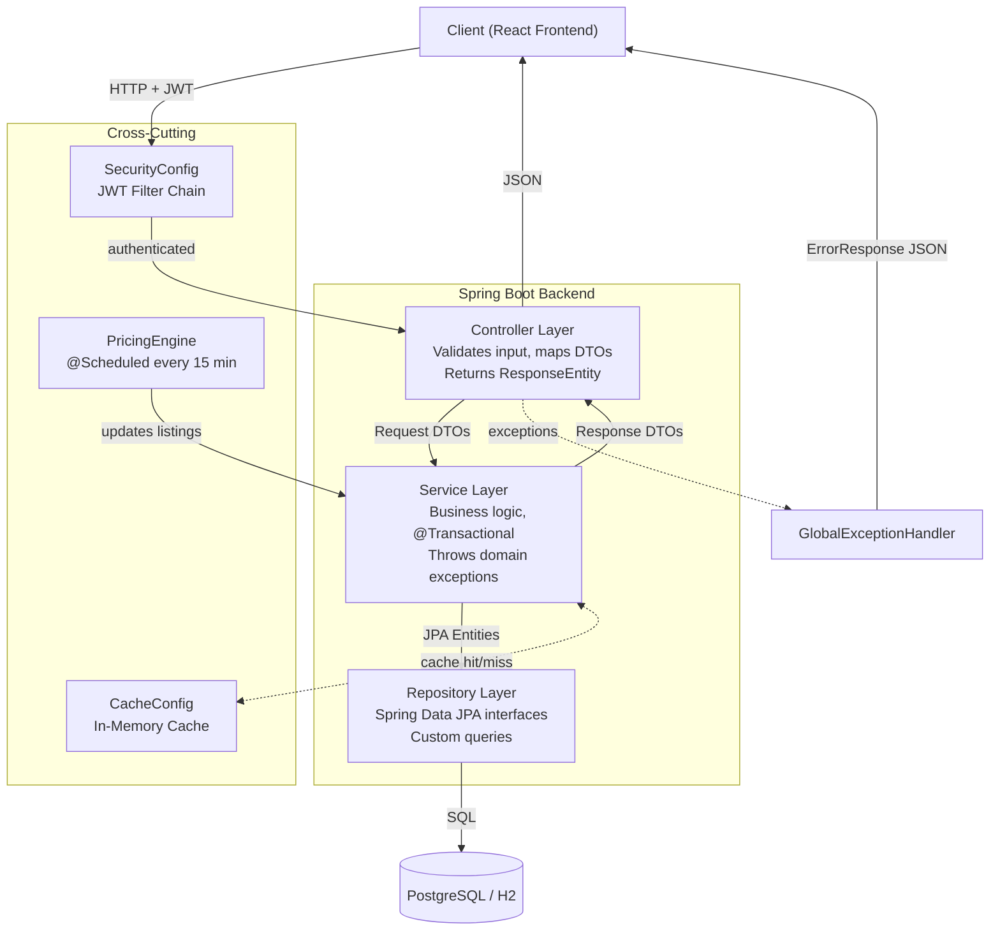

**Rules:**
- Controllers never access repositories directly.
- Services call other services (never other controllers).
- Entities never leak outside the service layer; DTOs are used for all external communication.
- All service methods that modify data are annotated with `@Transactional`.
- Read-only service methods use `@Transactional(readOnly = true)`.

### 4.2 Spring Security Configuration

**SecurityConfig.java** approach:

```java
@Configuration
@EnableWebSecurity
@EnableMethodSecurity
public class SecurityConfig {
    // SecurityFilterChain bean configuration:
    // - CSRF disabled (stateless JWT API)
    // - Session management: STATELESS
    // - Public endpoints: /api/v1/auth/**, /api/v1/events/**, /api/v1/venues/**,
    //   /api/v1/categories, /api/v1/tags, /api/v1/search/**, /api/v1/images/**,
    //   /swagger-ui/**, /v3/api-docs/**
    // - Admin endpoints: /api/v1/admin/** require ROLE_ADMIN
    // - All other endpoints require authentication
    // - JWT filter added before UsernamePasswordAuthenticationFilter
}
```

**JWT approach:**
- Access token: 15-minute expiry, stored in memory on frontend (not localStorage for security teaching)
- Refresh token: 7-day expiry, stored in HttpOnly cookie
- Token includes: userId, email, roles, expiry
- Library: `io.jsonwebtoken:jjwt-api:0.12.6`

#### Authentication Flow

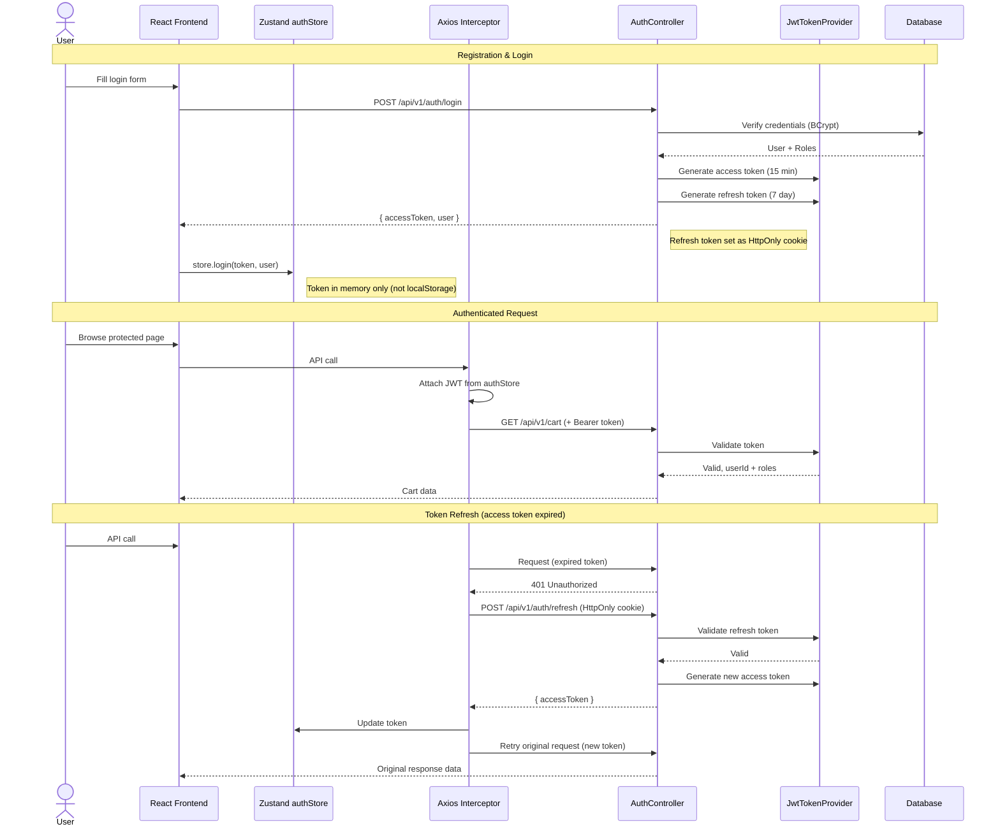

### 4.3 Dynamic Pricing Engine

The pricing engine is one of the most pedagogically important components. It computes a `price_multiplier` for each event's listings based on three factors:

**PricingEngine.java** -- key design:

```java
@Service
public class PricingEngine {

    // Three pricing factors, each returning a multiplier between 0.5 and 2.0:

    // 1. Supply Factor: based on available_tickets / total_tickets
    //    - 90%+ available -> 0.85 (prices drop to stimulate sales)
    //    - 50-90% available -> 1.0 (neutral)
    //    - 20-50% available -> 1.3 (scarcity premium)
    //    - <20% available -> 1.8 (high scarcity)

    // 2. Time Factor: based on days until event
    //    - 60+ days out -> 0.9 (early bird discount)
    //    - 14-60 days -> 1.0 (neutral)
    //    - 3-14 days -> 1.2 (urgency premium)
    //    - <3 days -> 1.5 (last-minute surge)
    //    - Day of event -> 0.7 (fire sale for unsold)

    // 3. Demand Factor: based on recent cart-adds and favorites
    //    - Computed from cart_items added in last 24 hours + recent favorites
    //    - Normalized to 0.9 - 1.5 range

    // Final multiplier = clamp(supply * time * demand, 0.5, 3.0)

    public BigDecimal computeMultiplier(Event event) { ... }
    public void updateEventPricing(Long eventId) { ... }  // recalculates and persists
    public void updateAllPricing() { ... }  // scheduled, runs every 15 minutes
}
```

A `@Scheduled` task calls `updateAllPricing()` every 15 minutes. Each update also writes a row to `price_history`, building the dataset students will use for ML exercises.

#### Dynamic Pricing Flow

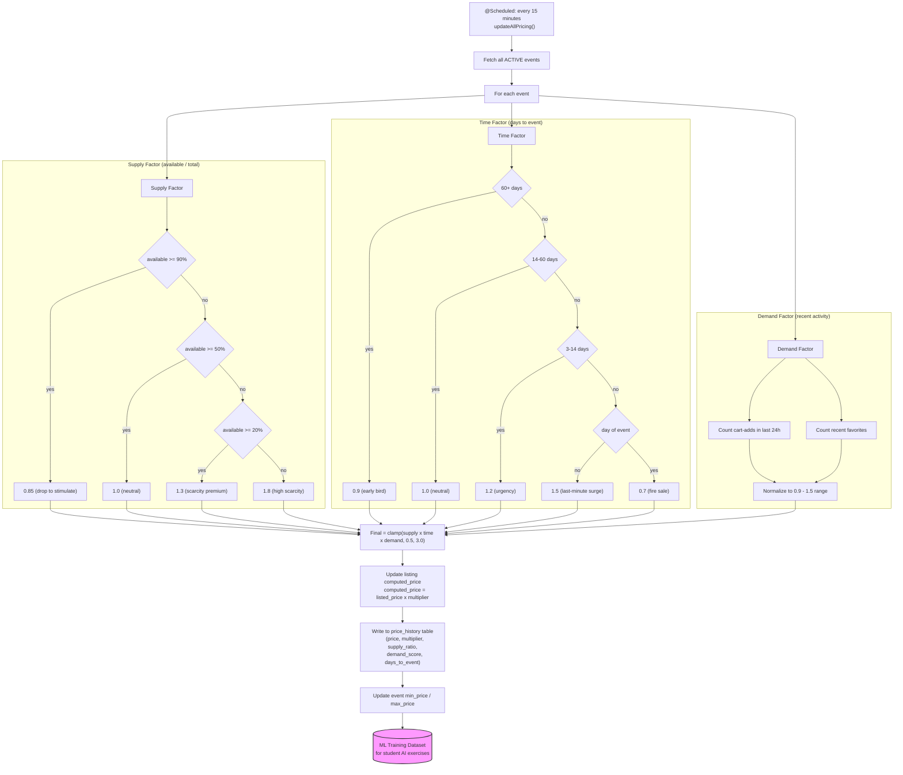

### 4.4 Payment Abstraction

```java
public interface PaymentService {
    PaymentIntentDto createPaymentIntent(Order order);
    PaymentConfirmation confirmPayment(String paymentIntentId);
    void handleWebhook(String payload, String sigHeader);
}

@Service
@Profile("stripe")
public class StripePaymentService implements PaymentService {
    // Real Stripe test-mode integration using stripe-java SDK
    // Creates PaymentIntent with amount, currency, metadata
    // Confirms via Stripe webhook or direct confirmation
}

@Service
@Profile("mock-payment")
public class MockPaymentService implements PaymentService {
    // Simulates payment flow with configurable delays
    // Always succeeds unless special test card numbers are used:
    //   "4000000000000002" -> decline
    //   "4000000000009995" -> insufficient funds
    //   All others -> success after 500ms simulated delay
    // Generates mock payment intent IDs: "mock_pi_<uuid>"
}
```

The `@Profile` annotation means exactly one implementation is active at runtime. The dev profile activates `mock-payment` by default; the docker/prod profiles activate `stripe`.

#### Checkout and Payment Flow

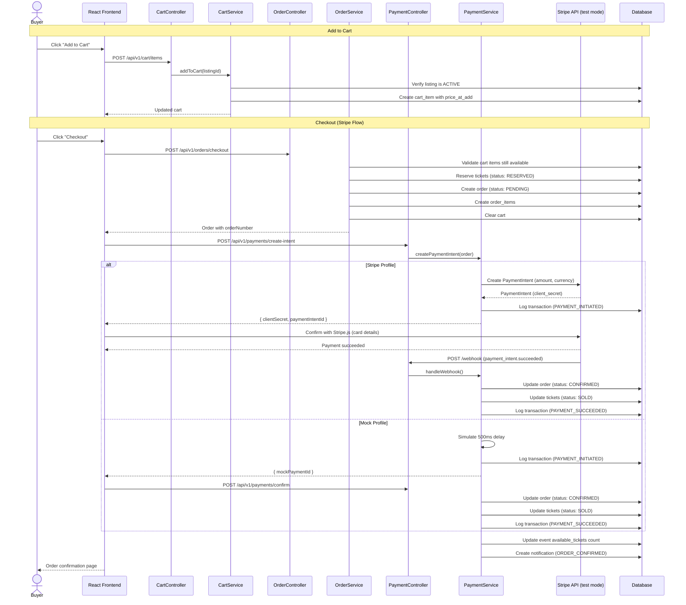

### 4.5 Notification Service

```java
@Service
public class NotificationService {
    // Creates notifications in the database
    // In v1: polling-based (frontend checks every 30 seconds)
    // Future: WebSocket/SSE push
    
    void notifyOrderConfirmed(Order order);
    void notifyEventReminder(Event event, User user);  // scheduled job, 24h before
    void notifyPriceDrop(Event event, User user);       // triggered by pricing engine
}
```

### 4.6 Image Storage

```java
public interface ImageStorageService {
    String store(MultipartFile file, String subdirectory);
    byte[] retrieve(String path);
    void delete(String path);
}

@Service
@Profile("!cloud-storage")
public class LocalImageStorageService implements ImageStorageService {
    // Stores images in configurable local directory (default: ./uploads/)
    // Generates thumbnails using java.awt.image (300x200px)
    // Returns relative path stored in event_images table
}
```

Future profiles can swap in S3 or GCS implementations.

### 4.7 Caching Strategy

**CacheConfig.java** uses Spring's `@EnableCaching` with an in-memory `ConcurrentMapCacheManager` for v1. Redis can be added later via profile.

Cached items:
- Categories list (rarely changes, cache 1 hour)
- Tags list (rarely changes, cache 1 hour)
- Venue details (rarely changes, cache 30 minutes)
- Featured events (cache 5 minutes)
- Event detail pages (cache 2 minutes, evicted on update)

Cart, orders, notifications, and pricing are never cached -- always fresh from the database.

### 4.8 Error Handling

**GlobalExceptionHandler.java** (`@RestControllerAdvice`):

```java
// Maps domain exceptions to HTTP responses:
// ResourceNotFoundException -> 404
// ConflictException -> 409 (e.g., ticket already sold)
// PaymentException -> 402
// UnauthorizedException -> 401
// MethodArgumentNotValidException -> 400 (validation errors)
// All others -> 500

// Standard error response shape:
record ErrorResponse(
    int status,
    String error,
    String message,
    Instant timestamp,
    Map<String, String> fieldErrors  // populated for validation errors
) {}
```

### 4.9 DTO vs Entity Separation

Every entity has at least one corresponding DTO (a Java record). The pattern:

- `*Request` records for incoming data (validated with Jakarta Bean Validation annotations)
- `*Dto` records for outgoing data (what the API returns)
- `*SummaryDto` for list views (subset of fields)
- Mapping is done explicitly in service methods (no MapStruct -- keep it simple for students)

Example:
```java
// Entity (package: com.mockhub.event.entity)
@Entity class Event extends BaseEntity { ... }

// Request DTO (package: com.mockhub.event.dto)
record EventCreateRequest(
    @NotBlank String name,
    @NotNull Long venueId,
    @NotNull Long categoryId,
    @NotNull Instant eventDate,
    @NotNull @Positive BigDecimal basePrice
) {}

// Response DTO
record EventDto(Long id, String name, String slug, ...) {}

// Summary DTO (for list views)
record EventSummaryDto(Long id, String name, String slug,
    String venueName, String city, Instant eventDate,
    BigDecimal minPrice, int availableTickets, String primaryImageUrl) {}
```

---

## 5. Frontend Architecture

### 5.1 Page / Route Structure

```
/                           -> HomePage (featured events, categories)
/login                      -> LoginPage
/register                   -> RegisterPage
/events                     -> EventListPage (search, filter, browse)
/events/:slug               -> EventDetailPage (listings, seat selection)
/cart                       -> CartPage
/checkout                   -> CheckoutPage (auth required)
/orders/:orderNumber/confirmation -> OrderConfirmationPage
/orders                     -> OrderHistoryPage (auth required)
/favorites                  -> FavoritesPage (auth required)
/admin                      -> AdminDashboardPage (admin required)
/admin/events               -> AdminEventsPage
/admin/events/new           -> AdminEventFormPage
/admin/events/:id/edit      -> AdminEventFormPage
/admin/users                -> AdminUsersPage
*                           -> NotFoundPage
```

Router implementation in `router.tsx` using React Router v7 with `createBrowserRouter`.

### 5.2 Component Hierarchy for Key Pages

**EventListPage:**
```
EventListPage
├── EventSearch (search bar with debounced input)
├── CategoryNav (horizontal scrollable category chips)
├── EventFilters (sidebar/drawer: date range, price range, tags, city)
├── Sort dropdown
├── EventGrid
│   ├── EventCard (image, name, venue, date, min price, favorite button)
│   ├── EventCard
│   └── ...
└── Pagination
```

**EventDetailPage:**
```
EventDetailPage
├── Event header (image carousel, name, date, venue, category/tags)
├── FavoriteButton
├── Tabs or sections:
│   ├── TicketListView (sortable table: section, row, seat, price)
│   │   └── Each row has "Add to Cart" button
│   ├── TicketGridView (grouped by section, visual layout)
│   │   └── SeatSelector (section cards with available count and price range)
│   └── PriceHistoryChart (line chart of price over time, using Recharts)
├── CartDrawer (slide-out panel showing current cart)
└── Event description / details
```

**CheckoutPage:**
```
CheckoutPage
├── OrderReview (list of items with prices)
├── CartSummary (subtotal, service fee, total)
├── PaymentSection
│   ├── StripePaymentForm (Stripe Elements, loaded when stripe profile)
│   └── MockPaymentForm (simple "Pay Now" button for mock profile)
└── Place Order button
```

### 5.3 State Management Strategy

**TanStack React Query** handles all server state:
- Event listings, event details, venues, categories, tags
- Cart contents (with optimistic updates)
- Orders, favorites, notifications
- Search results
- Admin data

**Zustand** handles client-only state:
- `authStore`: current user, JWT token (in memory, not persisted to localStorage), isAuthenticated, login/logout actions
- `cartStore`: cart item count (synced from React Query, used for header badge), cart drawer open/close state
- `uiStore`: mobile nav open/close, active filters, view mode (list/grid), theme preference

**Rationale:** React Query is the source of truth for any data that comes from the server. Zustand holds only UI state and the authentication token. This separation keeps things clean and avoids stale cache issues.

### 5.4 API Client Layer

**`api/client.ts`** creates a shared Axios instance:

```typescript
// Base URL from VITE_API_BASE_URL env var (default: http://localhost:8080/api/v1)
// Request interceptor: attaches JWT from authStore if present
// Response interceptor:
//   - 401 responses -> attempt token refresh, retry original request once
//   - If refresh fails -> clear auth state, redirect to /login
//   - Network errors -> show toast notification
```

Each `api/*.ts` file exports typed functions:

```typescript
// api/events.ts
export const getEvents = (params: EventSearchParams): Promise<PagedResponse<EventSummary>> =>
    client.get('/events', { params });

export const getEvent = (slug: string): Promise<EventDetail> =>
    client.get(`/events/${slug}`);
```

Each `hooks/use*.ts` file wraps these in React Query hooks:

```typescript
// hooks/useEvents.ts
export const useEvents = (params: EventSearchParams) =>
    useQuery({
        queryKey: ['events', params],
        queryFn: () => getEvents(params),
        staleTime: 2 * 60 * 1000,  // 2 minutes
    });

export const useEvent = (slug: string) =>
    useQuery({
        queryKey: ['events', slug],
        queryFn: () => getEvent(slug),
    });
```

### 5.5 Auth State Management

Flow:
1. User logs in via `POST /auth/login`
2. Server returns `{ accessToken, user }` and sets `refreshToken` as HttpOnly cookie
3. `authStore.login(token, user)` stores token in Zustand (memory only)
4. Axios interceptor reads from authStore for every request
5. On page refresh, `GET /auth/me` is called using the refresh token cookie to restore the session
6. If refresh token is expired, user is logged out

### 5.6 Responsive Design Approach

- **Mobile-first**: All layouts start from mobile breakpoints and scale up
- **Tailwind breakpoints**: `sm:` (640px), `md:` (768px), `lg:` (1024px), `xl:` (1280px)
- **Key responsive patterns**:
  - EventGrid: 1 column mobile, 2 columns sm, 3 columns lg, 4 columns xl
  - Filters: slide-out Sheet on mobile, sidebar on lg+
  - Cart: full page on mobile, drawer on md+
  - Admin: stacked on mobile, sidebar layout on lg+
  - Header: hamburger MobileNav on mobile, full nav on md+

---

## 6. Testing Strategy

### 6.1 Backend Testing

**Unit Tests (JUnit 5 + Mockito):**
- Every service class gets a unit test that mocks its repository dependencies
- PricingEngine gets thorough parametric tests covering all factor combinations
- Test naming: `methodName_givenCondition_expectedResult`
- Location: `src/test/java/com/mockhub/{feature}/service/*Test.java`

**Controller Tests (MockMvc + @WebMvcTest):**
- Each controller tested in isolation with mocked service layer
- Tests validate: HTTP status codes, response body shapes, validation error messages, auth requirements
- Location: `src/test/java/com/mockhub/{feature}/controller/*Test.java`

**Integration Tests (Testcontainers + @SpringBootTest):**
- `AbstractIntegrationTest` base class starts PostgreSQL via Testcontainers
- Tests exercise real database with Flyway migrations
- Cover full request lifecycle: HTTP request through to database verification
- Key integration test scenarios:
  - User registration and login flow
  - Event creation by admin, browsing by anonymous user
  - Full cart-to-checkout-to-order flow
  - Dynamic pricing updates
  - Concurrent ticket purchase (optimistic locking verification)
- Location: `src/test/java/com/mockhub/integration/*Test.java`

### 6.2 Frontend Testing

**Unit / Component Tests (Vitest + React Testing Library):**
- Component rendering tests for all custom components
- Hook tests for custom hooks (using `renderHook`)
- Store tests for Zustand stores
- Utility function tests
- Location: colocated with source files as `*.test.tsx` / `*.test.ts`

**API Mocking (MSW -- Mock Service Worker):**
- MSW handlers defined in `src/mocks/handlers.ts`
- Used by both Vitest tests and Storybook (if added later)
- Mirrors real API response shapes from TypeScript types

### 6.3 End-to-End Tests (Playwright)

Located in `frontend/e2e/`:

- `auth.spec.ts`: Register, login, logout, session persistence
- `event-browsing.spec.ts`: Search, filter, paginate, view detail
- `cart-checkout.spec.ts`: Add to cart, modify cart, checkout with mock payment
- `admin.spec.ts`: Create event, manage users, view dashboard

Run against full docker-compose stack (real backend + database).

### 6.4 Testing Pyramid Summary

| Layer | Tool | Count Target | Speed |
|---|---|---|---|
| Unit (service) | JUnit 5 + Mockito | ~80 tests | <10s |
| Controller | MockMvc | ~40 tests | <15s |
| Integration | Testcontainers | ~15 tests | <60s |
| Component (FE) | Vitest + RTL | ~60 tests | <20s |
| E2E | Playwright | ~10 scenarios | <120s |

---

## 7. Build Order / Phases

### Phase 1 -- Foundation (estimated: 2-3 days)

**Goal:** Project scaffolding, database, basic auth, and a single page rendering.

**Backend tasks:**
1. Initialize Spring Boot project with Gradle (Java 25, Spring Boot 3.4.x)
2. Add dependencies: Spring Web, Spring Data JPA, Spring Security, Spring Validation, Flyway, PostgreSQL driver, H2, jjwt, springdoc-openapi, Lombok (optional -- records may suffice)
3. Create `application.yml` with dev/docker/test profiles
4. Implement `BaseEntity`
5. Write Flyway migrations V1 through V4 (users, roles, venues, sections, rows, seats, events, categories, tags)
6. Implement User entity, Role entity, `user_roles` join
7. Implement `SecurityConfig`, `JwtTokenProvider`, `JwtAuthenticationFilter`, `UserDetailsServiceImpl`
8. Implement `AuthController` with register/login/me endpoints
9. Implement `GlobalExceptionHandler` and custom exceptions
10. Implement `OpenApiConfig` for Swagger UI at `/swagger-ui.html`

**Frontend tasks:**
1. Initialize Vite + React + TypeScript project
2. Install and configure: Tailwind CSS, shadcn/ui, React Router, TanStack Query, Zustand, Axios
3. Create `api/client.ts` with interceptors
4. Create `authStore.ts`
5. Create `MainLayout`, `Header`, `Footer`
6. Create `LoginPage`, `RegisterPage`
7. Create `ProtectedRoute`, `AdminRoute` components
8. Wire up auth flow end-to-end

**Infrastructure:**
1. Create `docker-compose.yml` with PostgreSQL container
2. Create `Dockerfile` for backend
3. Create `.gitignore`, `README.md`

**Deliverable:** A running app where users can register, log in, and see a placeholder home page. Swagger UI accessible.

---

### Phase 2 -- Catalog (estimated: 2-3 days)

**Goal:** Events, venues, categories, and browsing.

**Backend tasks:**
1. Implement Venue, Section, SeatRow, Seat entities and repositories
2. Implement Event, Category, Tag, EventTag entities and repositories
3. Implement `EventService` with search/filter/pagination (Spring Data Specifications)
4. Implement `EventController` with all GET endpoints
5. Implement `VenueController`
6. Implement `SearchService` using PostgreSQL `tsvector`
7. Implement `SearchController`

**Frontend tasks:**
1. Create `HomePage` with featured events and category navigation
2. Create `EventCard`, `EventGrid`, `EventSearch`, `EventFilters`, `CategoryNav`
3. Create `EventListPage` with full search/filter/sort/paginate
4. Create `EventDetailPage` (event info section -- ticket listings come in Phase 3)
5. Implement `useEvents`, `useSearch`, `usePagination` hooks

**Deliverable:** Users can browse, search, and filter events. Event detail pages show event information.

---

### Phase 3 -- Marketplace (estimated: 2-3 days)

**Goal:** Tickets, listings, dynamic pricing, seat selection.

**Backend tasks:**
1. Write Flyway migrations V4-V5 for tickets, listings, price_history
2. Implement Ticket, Listing, PriceHistory entities and repositories
3. Implement `TicketService` and `ListingService`
4. Implement `PricingEngine` with all three factors
5. Implement `PriceHistoryService`
6. Implement `TicketController` and `PriceController`
7. Add `@Scheduled` pricing update job
8. Write comprehensive `PricingEngineTest`

**Frontend tasks:**
1. Create `TicketListView` (sortable table of listings)
2. Create `TicketGridView` (grouped by section)
3. Create `SeatSelector` component
4. Create `PriceTag` component (shows price with visual indicator of up/down trend)
5. Add price history chart to EventDetailPage (using Recharts)
6. Implement `useTickets` hooks

**Deliverable:** Event detail pages show ticket listings with dynamic prices. Price history is visualized.

---

### Phase 4 -- Cart and Checkout (estimated: 2-3 days)

**Goal:** Shopping cart, checkout flow, payment processing.

**Backend tasks:**
1. Write Flyway migration V6 for cart, cart_items, orders, order_items
2. Implement Cart, CartItem, Order, OrderItem entities and repositories
3. Implement `CartService` (add, remove, clear, expiration handling)
4. Implement `OrderService` (checkout flow: validate cart, reserve tickets, create order)
5. Implement `PaymentService` interface + `MockPaymentService` + `StripePaymentService`
6. Write Flyway migration V11 for transaction_logs
7. Implement `TransactionLog` entity
8. Implement `CartController`, `OrderController`, `PaymentController`
9. Implement ticket status transitions (AVAILABLE -> RESERVED -> SOLD)
10. Add optimistic locking on Ticket entity (`@Version`)

**Frontend tasks:**
1. Create `CartDrawer`, `CartItem`, `CartSummary` components
2. Create `CartPage` (full page for mobile)
3. Create `cartStore` (item count, drawer state)
4. Create `CheckoutPage` with `OrderReview`
5. Create `MockPaymentForm` and `StripePaymentForm`
6. Create `OrderConfirmationPage`
7. Implement `useCart`, `useOrders` hooks with optimistic updates
8. Wire "Add to Cart" buttons on ticket listings

**Deliverable:** Full purchase flow from adding tickets to cart through payment to order confirmation.

---

### Phase 5 -- Engagement Features (estimated: 1-2 days)

**Goal:** Favorites, notifications, order history.

**Backend tasks:**
1. Write Flyway migration V7 for favorites, notifications
2. Implement Favorite entity, repository, service, controller
3. Implement Notification entity, repository, service, controller
4. Wire `NotificationService` into `OrderService` (order confirmation notifications)
5. Add scheduled event reminder job (24h before event)

**Frontend tasks:**
1. Create `FavoriteButton` component (heart icon with toggle)
2. Create `FavoritesPage`
3. Create `NotificationBell` component (in header, shows unread count, dropdown)
4. Create `OrderHistoryPage` with `OrderCard` components
5. Implement `useFavorites`, `useNotifications` hooks
6. Add notification polling (30-second interval via React Query `refetchInterval`)

**Deliverable:** Users can favorite events, see notification bell with unread count, and view order history.

---

### Phase 6 -- Admin Dashboard (estimated: 2 days)

**Goal:** Admin features for managing events, users, and viewing stats.

**Backend tasks:**
1. Implement `AdminService` (dashboard stats: total users, total orders, revenue, active events)
2. Implement `AdminController` with all admin endpoints
3. Implement event creation with ticket generation (admin creates event, system generates tickets for all seats)
4. Implement user management (list, role assignment, enable/disable)

**Frontend tasks:**
1. Create `AdminLayout` with sidebar navigation
2. Create `AdminDashboardPage` with stats cards and charts
3. Create `AdminEventsPage` with data table
4. Create `AdminEventFormPage` (create/edit event form)
5. Create `AdminUsersPage` with data table

**Deliverable:** Admins can manage events, generate tickets, view stats, and manage users.

---

### Phase 7 -- Images and Polish (estimated: 1-2 days)

**Goal:** Event images, seed data, responsive polish, API documentation.

**Backend tasks:**
1. Write Flyway migration V8 for event_images
2. Implement `ImageStorageService` + `LocalImageStorageService`
3. Implement `ImageController` for serving images and thumbnails
4. Implement `DataSeeder` with all sub-seeders (venues, events, tickets, users)
5. Create seed data JSON files (20+ venues, 100+ events, multiple artists)
6. Write remaining Flyway migrations (V9-V13) for future tables (reviews, conversations, preferences)
7. Finalize OpenAPI documentation with examples and descriptions

**Frontend tasks:**
1. Add image display throughout (event cards, event detail, venue)
2. Responsive design audit and fixes
3. Loading states with Skeleton components
4. Empty states for all list pages
5. Error boundary implementation
6. Mobile navigation polish

**Deliverable:** Polished, responsive application with realistic seed data and complete API documentation.

---

### Phase 8 -- Testing and E2E (estimated: 2 days)

**Goal:** Comprehensive test coverage.

**Backend tasks:**
1. Write remaining unit tests for all services
2. Write controller tests for all controllers
3. Create `AbstractIntegrationTest` with Testcontainers
4. Write integration tests for key flows

**Frontend tasks:**
1. Set up MSW handlers
2. Write component tests for critical components
3. Set up Playwright
4. Write E2E test scenarios

**Deliverable:** Full test suite passing, CI-ready.

---

### Parallelization Opportunities

These phases can be parallelized across agents:

- **Phase 1 backend** and **Phase 1 frontend** can run in parallel (backend auth API can be mocked on frontend initially)
- **Phase 2 backend** and **Phase 2 frontend** can run in parallel with MSW mocking
- Within any phase, **backend** and **frontend** work streams are parallelizable
- **Phase 5** (engagement) is independent of **Phase 6** (admin) -- fully parallelizable
- **Phase 8** (testing) can start for completed features while later phases are still in progress
- **Seed data creation** (Phase 7) is independent of all feature work and can run any time after migrations are defined

#### Build Phase Dependency Map

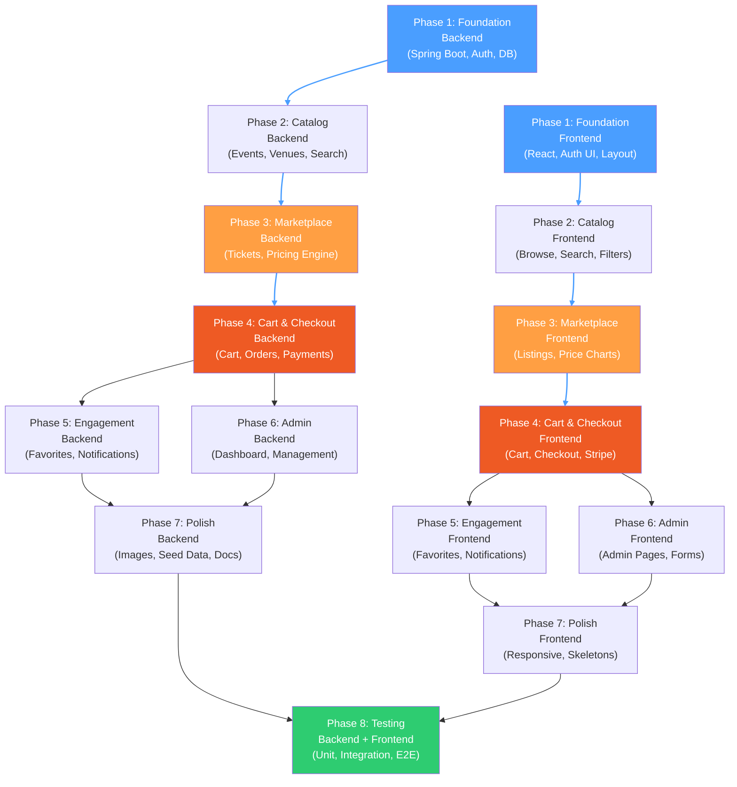

The diagram shows:
- **Horizontal pairs** (Backend ↔ Frontend) within each phase can run in **parallel**
- **Vertical chains** (Phase 1 → 2 → 3 → 4) are **sequential** dependencies
- **Phases 5 and 6** are independent of each other and can run in **parallel**
- **Phase 8 (Testing)** depends on all prior phases but can start incrementally for completed features

---

## 8. Docker / Infrastructure

### 8.1 docker-compose.yml

```yaml
services:
  postgres:
    image: postgres:17-alpine
    environment:
      POSTGRES_DB: mockhub
      POSTGRES_USER: mockhub
      POSTGRES_PASSWORD: mockhub_dev
    ports:
      - "5432:5432"
    volumes:
      - postgres_data:/var/lib/postgresql/data
    healthcheck:
      test: ["CMD-SHELL", "pg_isready -U mockhub"]
      interval: 5s
      timeout: 3s
      retries: 5

  backend:
    build: ./backend
    environment:
      SPRING_PROFILES_ACTIVE: docker
      SPRING_DATASOURCE_URL: jdbc:postgresql://postgres:5432/mockhub
      SPRING_DATASOURCE_USERNAME: mockhub
      SPRING_DATASOURCE_PASSWORD: mockhub_dev
      STRIPE_SECRET_KEY: ${STRIPE_SECRET_KEY:-sk_test_placeholder}
      STRIPE_WEBHOOK_SECRET: ${STRIPE_WEBHOOK_SECRET:-whsec_placeholder}
      JWT_SECRET: ${JWT_SECRET:-dev-jwt-secret-change-in-production}
    ports:
      - "8080:8080"
    depends_on:
      postgres:
        condition: service_healthy

  frontend:
    build: ./frontend
    environment:
      VITE_API_BASE_URL: http://localhost:8080/api/v1
      VITE_STRIPE_PUBLISHABLE_KEY: ${STRIPE_PUBLISHABLE_KEY:-pk_test_placeholder}
      VITE_PAYMENT_MODE: ${PAYMENT_MODE:-mock}
    ports:
      - "5173:80"
    depends_on:
      - backend

volumes:
  postgres_data:
```

### 8.2 docker-compose.dev.yml (override for local development)

```yaml
# Runs only Postgres; developers run backend and frontend on host
services:
  postgres:
    ports:
      - "5432:5432"
```

Usage: `docker compose -f docker-compose.dev.yml up -d`

### 8.3 Spring Profiles

**`application.yml`** (shared defaults):
```yaml
spring:
  application:
    name: mockhub
  jpa:
    open-in-view: false
    properties:
      hibernate:
        format_sql: true
  flyway:
    enabled: true
server:
  port: 8080
mockhub:
  jwt:
    secret: ${JWT_SECRET:dev-secret-key-minimum-256-bits-long-for-hmac-sha}
    access-token-expiry: 15m
    refresh-token-expiry: 7d
  pricing:
    update-interval: 900000  # 15 minutes in ms
  images:
    upload-dir: ./uploads
    max-size: 5MB
    thumbnail-width: 300
    thumbnail-height: 200
```

**`application-dev.yml`**:
```yaml
spring:
  datasource:
    url: jdbc:h2:mem:mockhub;DB_CLOSE_DELAY=-1
    driver-class-name: org.h2.Driver
  jpa:
    database-platform: org.hibernate.dialect.H2Dialect
    hibernate:
      ddl-auto: validate
  flyway:
    enabled: true
  h2:
    console:
      enabled: true
      path: /h2-console
  profiles:
    include: mock-payment
logging:
  level:
    com.mockhub: DEBUG
    org.springframework.security: DEBUG
```

**`application-docker.yml`**:
```yaml
spring:
  datasource:
    url: ${SPRING_DATASOURCE_URL}
    username: ${SPRING_DATASOURCE_USERNAME}
    password: ${SPRING_DATASOURCE_PASSWORD}
  jpa:
    database-platform: org.hibernate.dialect.PostgreSQLDialect
    hibernate:
      ddl-auto: validate
  profiles:
    include: stripe
```

**`application-test.yml`**:
```yaml
spring:
  datasource:
    url: jdbc:tc:postgresql:17-alpine:///mockhub
    driver-class-name: org.testcontainers.jdbc.ContainerDatabaseDriver
  jpa:
    hibernate:
      ddl-auto: validate
  flyway:
    enabled: true
  profiles:
    include: mock-payment
mockhub:
  jwt:
    secret: test-secret-key-minimum-256-bits-long-for-hmac-sha-algorithm
    access-token-expiry: 1h
    refresh-token-expiry: 1d
```

### 8.4 Backend Dockerfile

```dockerfile
FROM eclipse-temurin:25-jdk-alpine AS build
WORKDIR /app
COPY gradle/ gradle/
COPY gradlew build.gradle* settings.gradle* ./
RUN ./gradlew dependencies --no-daemon
COPY src/ src/
RUN ./gradlew bootJar --no-daemon

FROM eclipse-temurin:25-jre-alpine
WORKDIR /app
COPY --from=build /app/build/libs/*.jar app.jar
EXPOSE 8080
ENTRYPOINT ["java", "-jar", "app.jar"]
```

### 8.5 Frontend Dockerfile

```dockerfile
FROM node:25-alpine AS build
WORKDIR /app
COPY package.json package-lock.json ./
RUN npm ci
COPY . .
RUN npm run build

FROM nginx:alpine
COPY --from=build /app/dist /usr/share/nginx/html
COPY nginx.conf /etc/nginx/conf.d/default.conf
EXPOSE 80
```

### 8.6 Environment Configuration

Both `.env.example` files document all environment variables. The backend `.env.example`:
```
JWT_SECRET=your-secret-key-here-minimum-256-bits
STRIPE_SECRET_KEY=sk_test_...
STRIPE_WEBHOOK_SECRET=whsec_...
SPRING_PROFILES_ACTIVE=dev
```

The frontend `.env.example`:
```
VITE_API_BASE_URL=http://localhost:8080/api/v1
VITE_STRIPE_PUBLISHABLE_KEY=pk_test_...
VITE_PAYMENT_MODE=mock
```

### 8.7 CI Considerations

A GitHub Actions workflow should:
1. Run backend unit + controller tests (no Docker needed, uses H2)
2. Run backend integration tests (Testcontainers starts Postgres automatically)
3. Run frontend lint + type check + Vitest tests
4. Build Docker images (smoke test)
5. Run Playwright E2E against docker-compose stack

---

## Key Architectural Decisions and Rationale

1. **Feature-based packages** over layer-based: Each domain concept is self-contained, reducing merge conflicts for parallel agent work and making navigation intuitive for students.

2. **Flyway** over JPA auto-DDL: Students learn real migration practices. The `validate` DDL-auto mode ensures entities match migrations.

3. **JWT in memory** (not localStorage): Teaches security best practices. Refresh tokens in HttpOnly cookies prevent XSS token theft.

4. **Spring profiles for payment abstraction**: Demonstrates the Strategy pattern in a real, practical context. Students see how dependency injection and profiles enable swappable implementations.

5. **Denormalized counts** on events (`available_tickets`, `min_price`, `max_price`): Avoids expensive joins/aggregations on list pages. Updated transactionally when tickets change status.

6. **PostgreSQL `tsvector`** for search: Uses built-in PostgreSQL full-text search rather than adding Elasticsearch complexity. Adequate for v1 and the endpoint contract is stable for future replacement.

7. **Price history as a first-class table**: This is the dataset students will use for ML exercises. Every pricing update creates a historical record with contextual features (supply ratio, days to event, demand score).

8. **Future tables created empty**: Reviews, conversations, preferences tables exist with their schemas from day one. This means AI exercise code can write to these tables without needing migrations, and the foreign key relationships are properly defined.

9. **Recharts** for price visualization: Lightweight, React-native charting that integrates naturally with the component model. Students can extend it for ML visualizations.

10. **No Lombok**: Java records handle DTOs cleanly. Entities use explicit getters/setters, which is more transparent for students learning JPA.

---

---

## 9. Agent Team Organization

The build is organized into 5 waves of parallel agent work. Each wave's agents run in isolated git worktrees, then merge back before the next wave starts. A smoke test (compile + basic run) follows each merge.

### Wave 1 -- Foundation

Must complete before any other wave. Sets up project scaffolding, database schema, auth, and basic UI shell.

| Agent | Scope |
|-------|-------|
| **backend-foundation** | Spring Boot init, Gradle (Kotlin DSL), all 13 Flyway migrations, BaseEntity, auth (User/Role entities, SecurityConfig, JWT, AuthController), GlobalExceptionHandler, custom exceptions, OpenAPI config, all application YAML profiles |
| **frontend-foundation** | Vite + React + TS init, Tailwind/shadcn setup, Axios client with JWT interceptors, authStore (Zustand), MainLayout/Header/Footer, LoginPage, RegisterPage, ProtectedRoute/AdminRoute, React Router config |
| **infrastructure** | docker-compose.yml, docker-compose.dev.yml, backend Dockerfile, frontend Dockerfile, nginx.conf, .gitignore, .env.example files, project CLAUDE.md |

**Deliverable:** Running app with registration, login, placeholder home page, Swagger UI.

### Wave 2 -- Catalog and Marketplace

Events, venues, tickets, listings, dynamic pricing, browsing UI.

| Agent | Scope |
|-------|-------|
| **backend-catalog** | Phases 2-3: Venue/Section/SeatRow/Seat entities + repos, Event/Category/Tag entities + repos, EventService with search/filter/pagination (Spring Data Specifications), SearchService (PostgreSQL tsvector), PricingEngine + @Scheduled job, TicketService, ListingService, PriceHistoryService, all controllers |
| **frontend-catalog** | Phases 2-3: HomePage (featured events, categories), EventListPage (search, filter, sort, paginate), EventDetailPage, EventCard, EventGrid, EventSearch, EventFilters, CategoryNav, TicketListView, TicketGridView, SeatSelector, PriceTag, price history chart (Recharts), FavoriteButton placeholder, all hooks |

**Deliverable:** Users can browse, search, and filter events. Event detail pages show ticket listings with dynamic prices and price history charts.

### Wave 3 -- Commerce

Shopping cart, checkout, payment processing.

| Agent | Scope |
|-------|-------|
| **backend-commerce** | Phase 4: Cart/CartItem/Order/OrderItem entities + repos, CartService (add, remove, clear, expiration), OrderService (checkout flow, ticket reservation), PaymentService interface + MockPaymentService + StripePaymentService, TransactionLog entity, CartController, OrderController, PaymentController, ticket status transitions (AVAILABLE -> RESERVED -> SOLD), optimistic locking (@Version) |
| **frontend-commerce** | Phase 4: CartDrawer, CartItem, CartSummary, CartPage (mobile), cartStore (Zustand), CheckoutPage, OrderReview, MockPaymentForm, StripePaymentForm, OrderConfirmationPage, useCart/useOrders hooks with optimistic updates, "Add to Cart" buttons on ticket listings |

**Deliverable:** Full purchase flow from adding tickets to cart through payment to order confirmation.

### Wave 4 -- Engagement and Admin (parallel with each other)

Favorites, notifications, order history, admin dashboard. These two agents are independent and run in parallel.

| Agent | Scope |
|-------|-------|
| **backend-engagement-admin** | Phases 5-6: Favorite entity + repo + service + controller, Notification entity + repo + service + controller, NotificationService wired into OrderService (order confirmations), scheduled event reminder job (24h before), AdminService (dashboard stats), AdminController (all admin endpoints), event creation with ticket generation, user management (list, roles, enable/disable) |
| **frontend-engagement-admin** | Phases 5-6: FavoriteButton (heart toggle), FavoritesPage, NotificationBell (header, unread count, dropdown), OrderHistoryPage + OrderCard, notification polling (30s refetchInterval), AdminLayout (sidebar nav), AdminDashboardPage (stats cards + charts), AdminEventsPage (data table), AdminEventFormPage (create/edit), AdminUsersPage (data table), useFavorites/useNotifications hooks |

**Deliverable:** Favorites, notifications, order history, and full admin dashboard.

### Wave 5 -- Polish, Seed Data, and Testing

Images, realistic data, responsive polish, comprehensive tests.

| Agent | Scope |
|-------|-------|
| **seed-data-images** | Phase 7 backend: ImageStorageService interface + LocalImageStorageService, ImageResizer, ImageController, DataSeeder orchestrator + VenueSeeder/EventSeeder/TicketSeeder/UserSeeder, seed data JSON files (20+ venues, 100+ events, multiple artists), finalize OpenAPI documentation with examples |
| **frontend-polish** | Phase 7 frontend: Image display throughout (event cards, detail, venue), responsive design audit and fixes, Skeleton loading states, EmptyState components for all list pages, ErrorBoundary, mobile navigation polish, PriceDisplay component |
| **testing** | Phase 8: Backend unit tests (JUnit 5 + Mockito, all services), controller tests (MockMvc + @WebMvcTest, all controllers), AbstractIntegrationTest (Testcontainers), integration tests (auth, events, cart-checkout, admin flows), frontend MSW handlers, component tests (Vitest + React Testing Library), Playwright setup + E2E scenarios (auth, browsing, cart-checkout, admin) |

**Deliverable:** Polished, responsive app with realistic seed data, complete API docs, and full test suite.

### Wave Summary

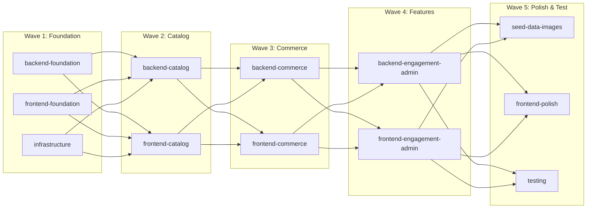

### Total: 11 agents across 5 waves

---

### Critical Files for Implementation

- `/Users/kennethkousen/Documents/AI/mockhub/backend/src/main/java/com/mockhub/config/SecurityConfig.java` - Central security configuration: JWT filter chain, endpoint permissions, CORS -- nearly everything depends on this being correct first.
- `/Users/kennethkousen/Documents/AI/mockhub/backend/src/main/java/com/mockhub/pricing/service/PricingEngine.java` - The dynamic pricing engine is the most algorithmically complex and pedagogically important backend component, directly producing the ML training dataset.
- `/Users/kennethkousen/Documents/AI/mockhub/backend/src/main/resources/db/migration/V2__create_venues_seats.sql` - The venue/section/row/seat schema with SVG coordinate columns is the most structurally complex migration and must be correct before tickets, listings, or seed data can work.
- `/Users/kennethkousen/Documents/AI/mockhub/frontend/src/api/client.ts` - The Axios client with JWT interceptor and refresh logic -- every frontend feature depends on this working correctly.
- `/Users/kennethkousen/Documents/AI/mockhub/backend/src/main/java/com/mockhub/seed/DataSeeder.java` - The seed data orchestrator that populates venues, events, tickets, and price history -- essential for both the teaching platform and AI exercises.