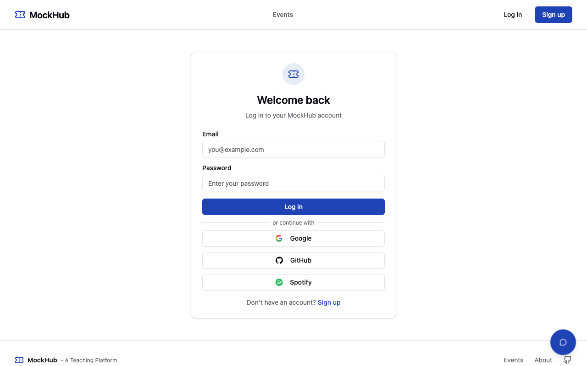
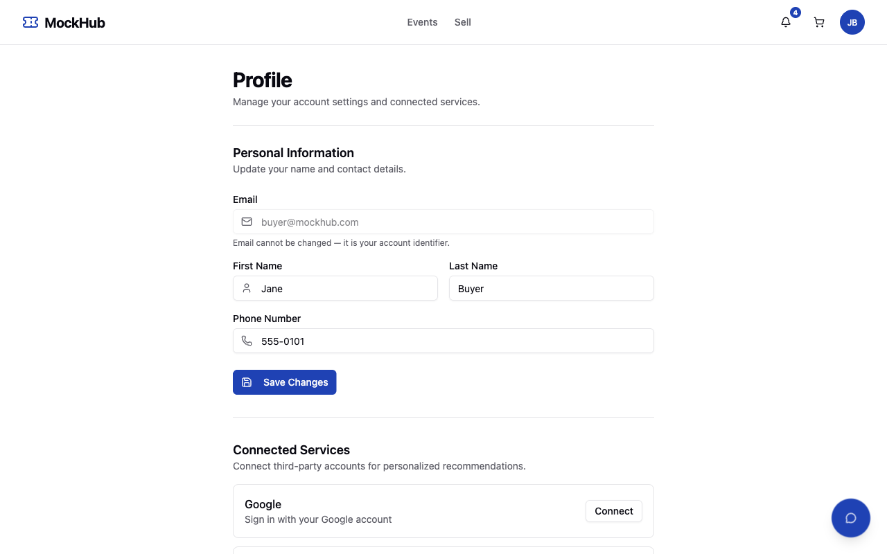
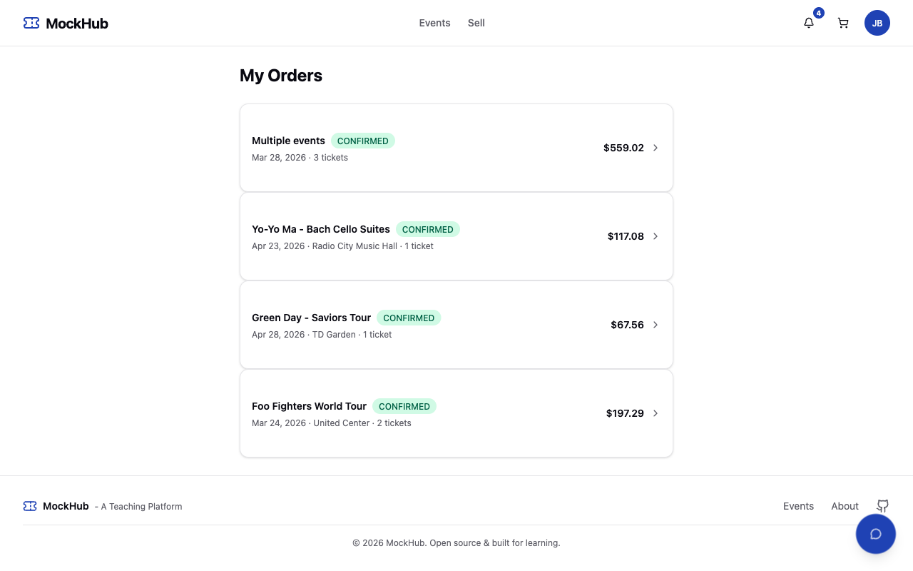
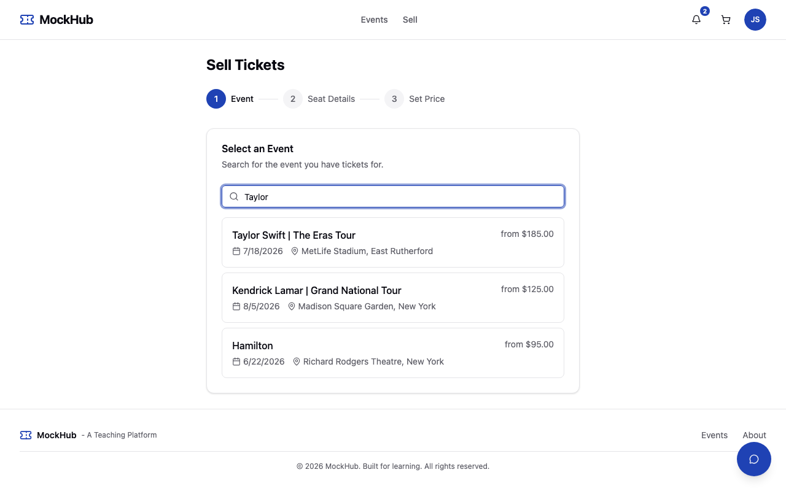
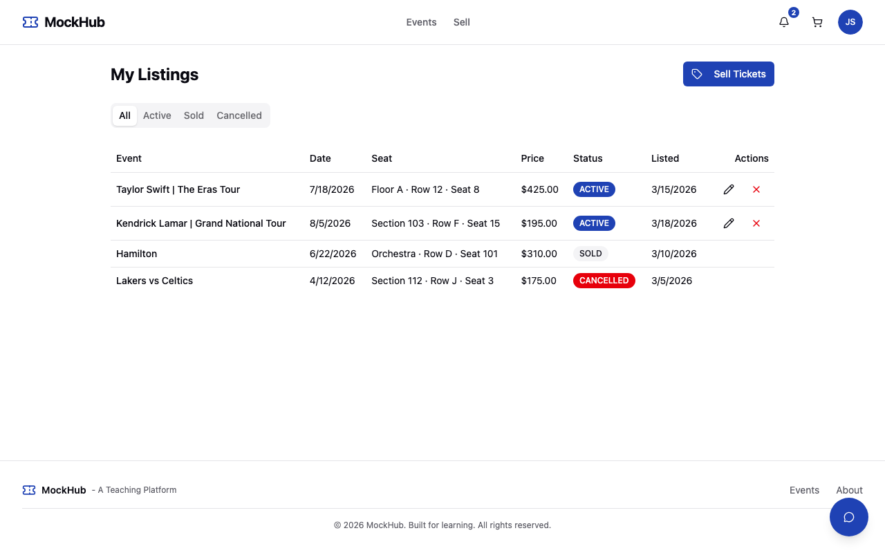
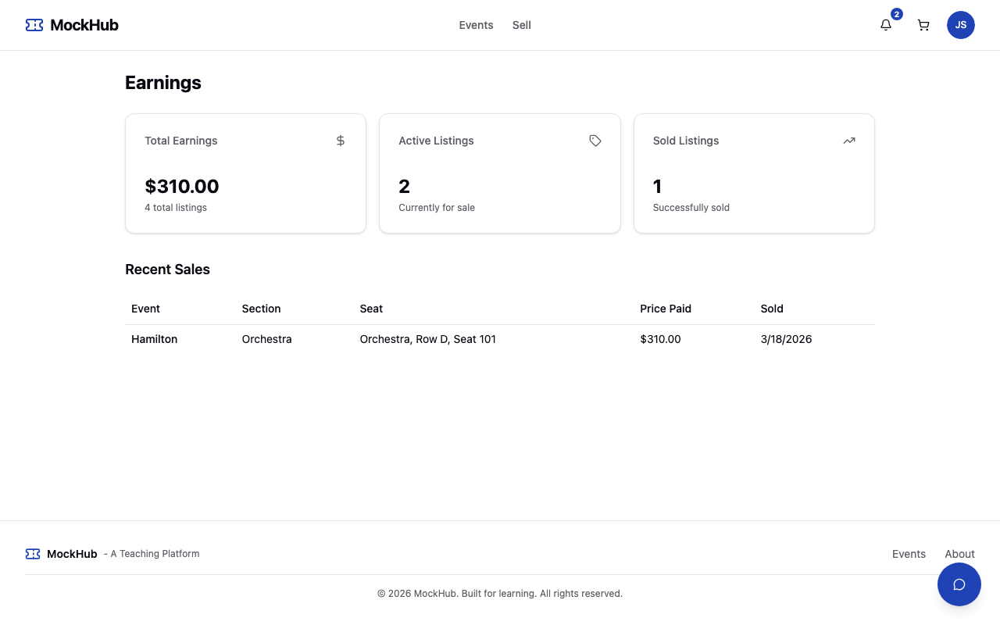
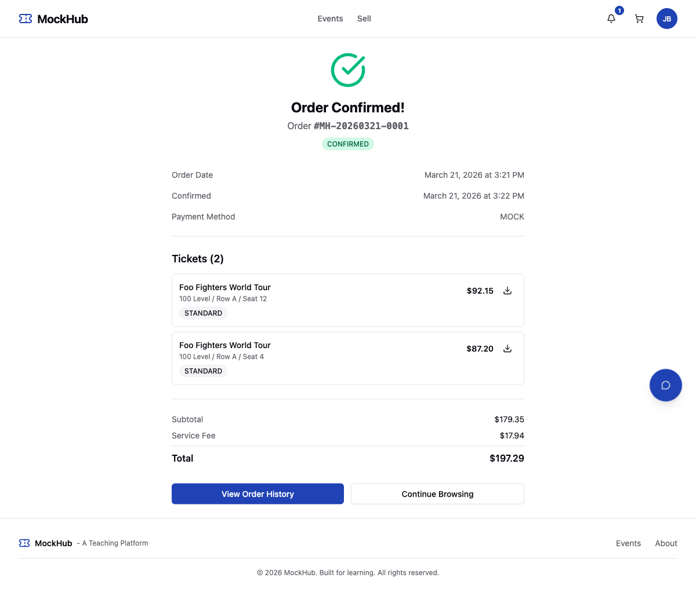
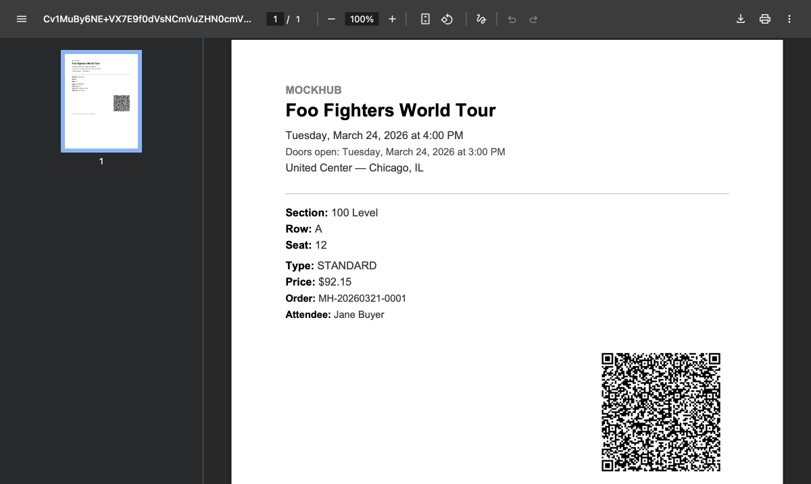
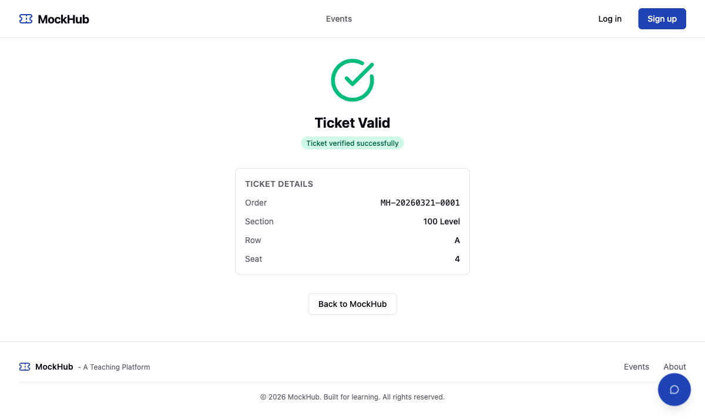

# MockHub

A secondary concert ticket marketplace built as a teaching platform for AI integration.

MockHub mimics the functionality of sites like StubHub and TicketNetwork — registration, event browsing, seat selection, dynamic pricing, and checkout — providing a realistic, full-featured codebase for students to build AI features on top of.

**Live demo:** [mockhub.kousenit.com](https://mockhub.kousenit.com) — log in with `buyer@mockhub.com` / `buyer123`


### AI-Powered Features


## Tech Stack

| Layer | Technology |
|-------|-----------|
| Backend | Spring Boot 4, Java 25, Spring AI 2.0.0-M3 |
| Database | PostgreSQL 17 (full-text search via tsvector) |
| Frontend | React 19, TypeScript, Tailwind CSS, shadcn/ui |
| Build | Gradle 9.4.0, Vite |
| Testing | JUnit 5, Testcontainers, Vitest, Playwright |
| Payments | Stripe (test mode) + mock fallback |
| Notifications | Twilio SMS, Resend email (REST API + SMTP fallback) |
| MCP Auth | OAuth 2.1 + DCR via Spring Authorization Server + mcp-security |

## Prerequisites

- Java 25 ([Eclipse Temurin](https://adoptium.net/) recommended)
- Node.js 22+
- Docker and Docker Compose

## Quick Start

```bash
# 1. Clone and start the database
git clone https://github.com/kousen/mockhub.git
cd mockhub
docker compose -f docker-compose.dev.yml up -d

# 2. Run the backend (API at localhost:8080, Swagger at localhost:8080/swagger-ui.html)
cd backend
./gradlew bootRun

# 3. Run the frontend (app at localhost:5173)
cd ../frontend
npm install
npm run dev
```

To run everything in Docker instead: `docker compose up --build`

### Enabling AI

AI features require an API key and a provider profile:

```bash
# Anthropic Claude (recommended)
SPRING_PROFILES_ACTIVE=dev,ai-anthropic ./gradlew bootRun

# OpenAI or Ollama (local, no key needed)
SPRING_PROFILES_ACTIVE=dev,ai-openai ./gradlew bootRun
SPRING_PROFILES_ACTIVE=dev,ai-ollama ./gradlew bootRun
```

Without an AI profile, AI endpoints return 503 and the frontend hides AI components gracefully.

## Demo Accounts

| Email | Password | Notes |
|-------|----------|-------|
| `buyer@mockhub.com` | `buyer123` | Standard user |
| `seller@mockhub.com` | `seller123` | Standard user |
| `admin@mockhub.com` | `admin123` | Admin access |

Any authenticated user can both buy and sell tickets.

## Key Features

- **Event browsing** — search, filter by category/city/date/price, sort, paginate
- **Dynamic pricing** — prices adjust based on supply, demand, and time to event
- **Shopping cart and checkout** — full purchase flow with Stripe test mode
- **Seller marketplace** — any user can list tickets, manage listings, track earnings
- **OAuth social login** — Google, GitHub, and Spotify sign-in alongside email/password
- **User profiles** — edit name/phone, view connected OAuth providers
- **Spotify integration** — embedded player, artist genres, metadata, and personalized recommendations based on listening history (top artists, genres, recently played)
- **AI chat assistant** — ask questions about events and pricing (function-calling enabled)
- **AI recommendations** — personalized event suggestions with relevance scores
- **AI price predictions** — trend analysis on event detail pages
- **MCP server** — 23 tools for AI agent integration (events, cart, orders, pricing, mandates) with OAuth 2.1 authentication and Dynamic Client Registration (DCR) — works natively with Claude (desktop, web, mobile), Cursor, and any MCP-compatible client
- **Agent mandates** — authorization model for AI agents with spending limits and scope restrictions
- **ACP endpoints** — Agentic Commerce Protocol checkout API for agent interoperability
- **Agent discovery** — `llms.txt` at `/llms.txt` describes all API endpoints, MCP tools, and ACP endpoints

### Social Login & Profile





### My Orders



### Seller Flow







### Ticket Delivery

- **PDF tickets with signed QR codes** — downloadable from order confirmation page
- **SMS notifications** via Twilio — tap the link to view tickets instantly (no login required)
- **Email confirmations** via Resend SMTP — HTML email with "View Your Tickets" button
- **Public ticket view** — mobile-optimized page showing scannable QR codes, authenticated by signed JWT tokens
- **Venue verification** — scan QR code at entry, tracks first scan with "already scanned" warnings
- **Calendar integration** — download `.ics` file to add event to any calendar app







## Testing

```bash
# Backend (requires Docker for Testcontainers)
cd backend && ./gradlew test

# Frontend component tests
cd frontend && npm test

# E2E tests (requires backend running)
cd frontend && npx playwright test
```

## Deployment

Deployed on [Railway](https://railway.com) as a single Docker container serving both the API and the React SPA. Pushes to `main` trigger automatic deployments. See [ARCHITECTURE.md](ARCHITECTURE.md) for deployment configuration details.

## Further Reading

- [ARCHITECTURE.md](ARCHITECTURE.md) — database schema, API design, backend/frontend architecture, testing strategy
- [CLAUDE.md](CLAUDE.md) — implementation rules and conventions for contributors
- [docs/agentic-commerce.md](docs/agentic-commerce.md) — MCP tools, agent mandates, ACP endpoints, protocol landscape
- [docs/evaluation-conditions.md](docs/evaluation-conditions.md) — Design by Contract sanity checks for AI agents
- [docs/stripe-test-setup.md](docs/stripe-test-setup.md) — Stripe test mode configuration

## License

[MIT](LICENSE)
