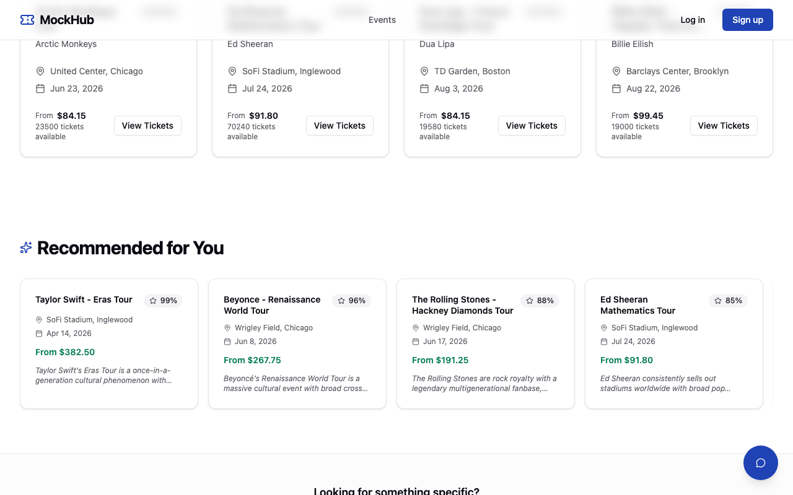
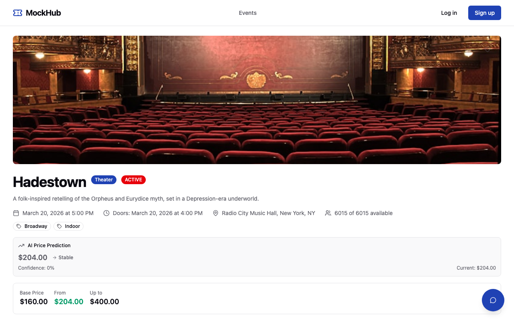
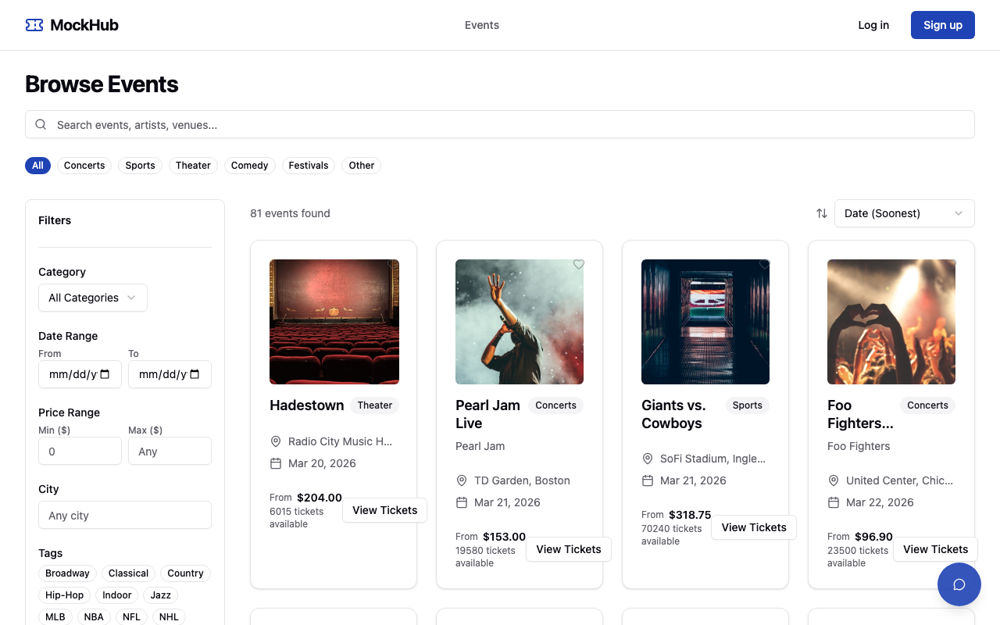

# MockHub

A secondary concert ticket marketplace built as a teaching platform for AI integration.

MockHub mimics the functionality of sites like StubHub and TicketNetwork — registration, event browsing, seat selection, dynamic pricing, and checkout — providing a realistic, full-featured codebase for students to build AI features on top of.


### AI-Powered Features








## Tech Stack

| Layer | Technology |
|-------|-----------|
| Backend | Spring Boot 4, Java 25, Spring AI 2.0.0-M3 |
| Database | PostgreSQL 17 + pgvector |
| Frontend | React 19, TypeScript, Tailwind CSS, shadcn/ui |
| Build | Gradle 9.4.0, Vite |
| Testing | JUnit 5, Testcontainers, Vitest, Playwright |
| Payments | Stripe (test mode) |

## Prerequisites

- Java 25 ([Eclipse Temurin](https://adoptium.net/) recommended)
- Node.js 22+
- Docker and Docker Compose
- Git

## Quick Start

### 1. Clone the repository

```bash
git clone https://github.com/kousen/mockhub.git
cd mockhub
```

### 2. Start the database

```bash
docker compose -f docker-compose.dev.yml up -d
```

This starts PostgreSQL with the pgvector extension on port 5432.

### 3. Run the backend

```bash
cd backend
./gradlew bootRun
```

The API will be available at `http://localhost:8080`. Swagger UI at `http://localhost:8080/swagger-ui.html`.

### 4. Run the frontend

```bash
cd frontend
npm install
npm run dev
```

The app will be available at `http://localhost:5173`.

## Full Docker Stack

To run everything in containers:

```bash
docker compose up --build
```

- Frontend: `http://localhost:5173`
- Backend API: `http://localhost:8080`
- Swagger UI: `http://localhost:8080/swagger-ui.html`

## Project Structure

```
mockhub/
├── backend/          # Spring Boot application
│   ├── src/main/java/com/mockhub/
│   │   ├── auth/     # Authentication (JWT, Spring Security)
│   │   ├── event/    # Events, categories, tags
│   │   ├── venue/    # Venues, sections, seats
│   │   ├── ticket/   # Tickets and listings
│   │   ├── pricing/  # Dynamic pricing engine
│   │   ├── cart/     # Shopping cart
│   │   ├── order/    # Orders and checkout
│   │   ├── payment/  # Stripe + mock payment
│   │   ├── favorite/ # User favorites
│   │   ├── notification/ # In-app notifications
│   │   ├── ai/       # AI-powered chat, recommendations, price predictions
│   │   ├── admin/    # Admin dashboard
│   │   ├── search/   # Full-text search
│   │   ├── image/    # Image storage
│   │   ├── seed/     # Seed data generation
│   │   ├── config/   # App configuration
│   │   └── common/   # Shared utilities, exceptions, base entity
│   └── src/test/
├── frontend/         # React application
│   ├── src/
│   │   ├── api/      # API client functions
│   │   ├── hooks/    # React Query hooks
│   │   ├── stores/   # Zustand state stores
│   │   ├── pages/    # Route pages
│   │   ├── components/ # UI components
│   │   ├── types/    # TypeScript type definitions
│   │   └── lib/      # Utilities
│   └── e2e/          # Playwright E2E tests
├── docker-compose.yml     # Full stack
├── docker-compose.dev.yml # Database only
└── ARCHITECTURE.md        # Detailed architecture plan
```

## Testing

### Backend

```bash
cd backend

# Unit + controller + integration tests (requires Docker for Testcontainers)
./gradlew test
```

### Frontend

```bash
cd frontend

# Component tests
npm test

# E2E tests (requires backend running — see below)
npx playwright test

# AI-specific E2E tests only
npx playwright test e2e/ai-features.spec.ts

# E2E with specific browser
npx playwright test --project=chromium
```

### E2E Tests with AI

E2E tests include AI feature tests that call a real Claude Haiku model. Start the backend with AI before running:

```bash
# Terminal 1: start backend with Haiku
cd backend
SPRING_PROFILES_ACTIVE=dev-ai,ai-anthropic \
SPRING_AI_ANTHROPIC_CHAT_OPTIONS_MODEL=claude-haiku-4-5 \
./gradlew bootRun

# Terminal 2: run E2E tests
cd frontend
npx playwright test
```

CI runs these automatically using the `ANTHROPIC_API_KEY` GitHub secret.

## AI Features

MockHub includes working AI-powered endpoints backed by Spring AI:

| Endpoint | Description |
|----------|-------------|
| `POST /api/v1/chat` | Chat assistant — ask questions about events, pricing, recommendations |
| `GET /api/v1/recommendations` | AI-ranked event recommendations with relevance scores and reasons |
| `GET /api/v1/events/{slug}/predicted-price` | Price trend prediction based on historical pricing data |

### Enabling AI

AI features require the `dev-ai` profile (not plain `dev`, which disables AI). Set the profile and API key:

```bash
# Anthropic Claude
SPRING_PROFILES_ACTIVE=dev-ai,ai-anthropic ./gradlew bootRun
# Requires ANTHROPIC_API_KEY environment variable

# OpenAI
SPRING_PROFILES_ACTIVE=dev-ai,ai-openai ./gradlew bootRun
# Requires OPENAI_API_KEY environment variable

# Ollama (local, no API key needed)
SPRING_PROFILES_ACTIVE=dev-ai,ai-ollama ./gradlew bootRun
```

**Why `dev-ai`?** The default `dev` profile group includes `no-ai`, which excludes all AI auto-configurations. The `dev-ai` group omits that exclusion. Each AI provider profile also excludes the other providers to avoid bean conflicts.

Without an AI profile, these endpoints return 503 with a message indicating which profile to activate. The frontend AI components (chat widget, recommendations, price predictions) hide gracefully when AI is not configured.

### AI Frontend Components

- **Chat widget** — floating button (bottom-right) opens a slide-out conversation panel
- **Recommendations** — "Recommended for You" section on the homepage with AI-ranked events
- **Price prediction** — badge on event detail pages showing predicted price, trend, and confidence

### AI Agent Discovery

The API serves an `llms.txt` file at `/llms.txt` describing all endpoints for AI agent consumption. Error responses follow [RFC 9457 Problem Details](https://www.rfc-editor.org/rfc/rfc9457) format.

### MCP Server

MockHub embeds an MCP (Model Context Protocol) server that exposes 13 tools for AI agents via Streamable HTTP:

| Category | Tools |
|----------|-------|
| Events | `searchEvents`, `getEventDetail`, `getEventListings`, `getFeaturedEvents` |
| Pricing | `getPriceHistory`, `getPricePrediction` |
| Cart | `getCart`, `addToCart`, `removeFromCart`, `clearCart` |
| Orders | `checkout`, `getOrder`, `listOrders` |

MCP endpoint: `POST /mcp` with `X-API-Key: mockhub-dev-key` header. Uses session-based communication — initialize first, then include the `Mcp-Session-Id` header in subsequent requests.

## Data Oriented Programming

The backend demonstrates Java DOP patterns:

- **Sealed exception hierarchy** — `DomainException` is an `abstract sealed class` with four `final` subtypes (`ResourceNotFoundException`, `ConflictException`, `PaymentException`, `UnauthorizedException`)
- **Exhaustive pattern matching** — `GlobalExceptionHandler` uses a switch expression over the sealed hierarchy with no default case; the compiler enforces completeness
- **Records everywhere** — all 38 DTOs are records, including `EventSearchRequest` with a compact constructor for default values

## Environment Variables

Copy `.env.example` files in `backend/` and `frontend/` to `.env` and configure:

| Variable | Required | Description |
|----------|----------|-------------|
| `JWT_SECRET` | Yes | JWT signing key (min 256 bits) |
| `STRIPE_SECRET_KEY` | For Stripe | Stripe test secret key (`sk_test_...`) |
| `STRIPE_WEBHOOK_SECRET` | For Stripe | Stripe webhook signing secret |
| `ANTHROPIC_API_KEY` | For AI | Anthropic API key |
| `OPENAI_API_KEY` | For AI | OpenAI API key |

## Seed Accounts

| Email | Password | Roles |
|-------|----------|-------|
| `admin@mockhub.com` | `admin123` | Admin, User |
| `buyer@mockhub.com` | `buyer123` | User |
| `seller@mockhub.com` | `seller123` | User |

## Contributing

See [CONTRIBUTING.md](CONTRIBUTING.md) for guidelines.

## Code of Conduct

See [CODE_OF_CONDUCT.md](CODE_OF_CONDUCT.md).

## License

[MIT](LICENSE)
